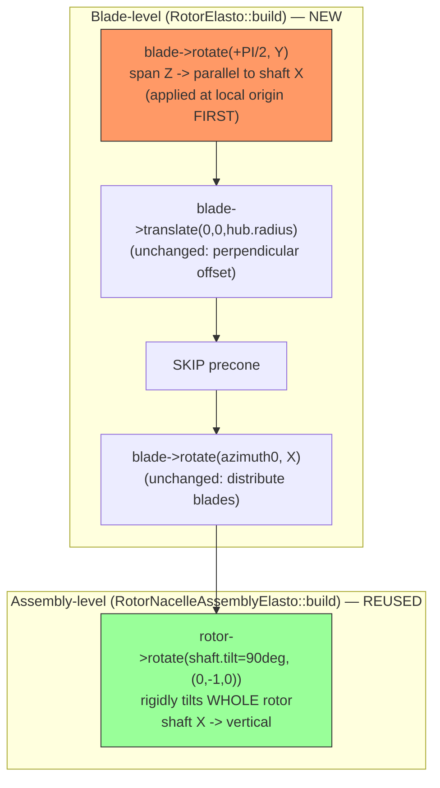

# Implementation Plan — Vertical-Axis Turbine (VAWT) "Quick Hack" Route

> **Purpose.** This is an implementation prompt/plan for enabling a
> **vertical-axis wind/current turbine** (VAWT) geometry in SEAHOWL via the
> minimal, hardcoded "Option A" route, so that AeroDyn/OLAF can be driven with
> `TurbineIsHAWT = 0`. It captures the code changes, files to touch,
> verification steps, and a step-by-step process discussed during the
> feasibility study (see
> [doc/source/dev-guide/vertical-axis-turbines.md](doc/source/dev-guide/vertical-axis-turbines.md)).
>
> **Scope.** Option A only (throwaway spike / proof of concept). Option B
> (schema-driven, reusable) is intentionally out of scope here and is
> documented separately in the feasibility study.
>
> **Convention (per repo copilot-instructions).** Facts are cited with
> `file:line`. Interpretations, hypotheses and unverified assumptions are
> explicitly marked `Hypothesis` / `TODO`. Do not treat any geometry sign or
> rotation composition as correct until confirmed via VTK output.

> **STATUS (implemented & verified, 2026-07-17).** This was implemented and run
> end-to-end. Rather than the hardcoded local flag described below, the VAWT
> switch was made an **input-gated** boolean `"vertical_axis"` on the rotor
> (backward compatible; HAWT decks are unaffected), threaded to both the blade
> placement (`RotorElasto::build`) and AeroDyn (`TurbineIsHAWT`). A complete
> example deck lives in [data/VAWT_OLAF/](data/VAWT_OLAF/) and is run through
> SEAHOWL by [examples/python/ex_vawt.py](examples/python/ex_vawt.py). Verified
> results: AeroDyn selected `projMod: 3` (lifting line) automatically, the
> blades are built parallel to the vertical spin axis, the rotor free-spins
> from 168.6 rpm, and flexible blade deformation is captured. The single blade
> reorientation rotation `rotate(+PI/2, Y)` (with `azimuth` about X and
> `shaft.tilt = 90` deg) was sufficient — no second rotation was needed.

---

## 1. Background — why a VAWT cannot currently be represented

**Fact.** SEAHOWL builds the rotor with blades whose span is **always radial**
(perpendicular to the shaft/rotation axis). The placement happens in
`RotorElasto::build()`
([src/elasto/rotor_elasto.cpp:41-60](src/elasto/rotor_elasto.cpp)):

```cpp
// current per-blade placement
blade->translate(Vector3d(0.0, 0.0, hub.radius));                 // offset root radially along +Z
blade->rotate(blade->precone, Vector3d(0.0, 1.0, 0.0));           // precone about Y (edgewise)
double azimuth0 = ii * 2 * PI / nblades;
blade->rotate(azimuth0, Vector3d(1.0, 0.0, 0.0));                 // distribute about shaft axis X
```

**Fact.** The blade-local convention (IEC) is documented in
[src/elasto/chrono_adapters.cpp:52-60](src/elasto/chrono_adapters.cpp):
- blade-local `Z` = span (root → tip),
- blade-local `Y` = edgewise (towards trailing edge),
- blade-local `X` = flapwise (towards nacelle).

The shaft / rotation axis is blade/hub-local `X` (see the code comment
`// X is the axis pointing towards nacelle` at
[src/elasto/rotor_elasto.cpp:57](src/elasto/rotor_elasto.cpp)).

**Fact.** For AeroDyn, `TurbineIsHAWT` is hardcoded to `1` and never toggled
([src/fluid/aero/aerodyn_adapter.cpp:172](src/fluid/aero/aerodyn_adapter.cpp)),
and passed to `ADI_C_SetupRotor`
([src/fluid/aero/aerodyn_adapter.cpp:379](src/fluid/aero/aerodyn_adapter.cpp)).

---

## 2. Core geometric idea

The desired configuration is **two rotations at two different levels**, which
happen to share the same axis (Y) but must not be conflated:

| Level | What it achieves | Where | Change? |
|---|---|---|---|
| **Blade-level** | Reorient each blade's span (local `Z`) to be **parallel** to the shaft axis (local `X`), offset by `hub.radius` | `RotorElasto::build()` | **NEW rotation** |
| **Assembly-level** | Rotate the whole (already-correct) rotor so the shaft axis `X` points **vertical** | `RotorNacelleAssemblyElasto::build()` via `shaft.tilt = 90°` | **No code change** (reuse existing field) |



### Why ordering is critical (the subtle bug to avoid)

**Fact.** `Entity::rotate()`
([src/commons/entities.cpp:25-30](src/commons/entities.cpp)) rotates **both
position and orientation** about the frame's current origin:

```cpp
void Entity::rotate(double angle, const Vector3d& axis) {
    auto rotation = AngleAxisd(angle, axis);
    auto new_position = rotation * get_position();   // position IS moved
    auto new_rotation = (rotation * get_rotation()).normalized();
    set_position(new_position);
    set_rotation(new_rotation);
}
```

**Interpretation / consequence.** The new blade-level rotation must be applied
**before** `translate(0,0,hub.radius)`, while the blade still sits at the local
origin. At the origin, `rotation * (0,0,0) = (0,0,0)`, so the rotation only
changes orientation (and re-points the on-axis span nodes) without displacing
the root. If instead it were applied **after** the radial translate, it would
swing the already-offset root `(0,0,hub.radius)` onto the shaft axis, and the
subsequent `rotate(azimuth0, X)` (which leaves on-axis points invariant) would
**collapse all blades onto the same location**. This was a real error in an
earlier draft and is the single most important correctness point of this plan.

**Fact.** For FEA blades, `rotate`/`translate` are forwarded to **every span
node**, not just the root
([src/elasto/blade_elasto.cpp:96-106](src/elasto/blade_elasto.cpp),
`BladeElastoFEA::rotate/translate` → `ComponentElastoFEA::rotate/translate`),
so the reordering rigidly reorients the whole blade consistently.

---

## 3. Files to touch

| # | File | Change | Type |
|---|---|---|---|
| 1 | [src/elasto/rotor_elasto.cpp](src/elasto/rotor_elasto.cpp) | Add gated VAWT branch in `RotorElasto::build()`: rotate blade span parallel to shaft **before** the radial translate; skip precone | **Code** |
| 2 | [src/fluid/aero/aerodyn_adapter.cpp](src/fluid/aero/aerodyn_adapter.cpp) | Flip `TurbineIsHAWT` from `1` to `0` (line 172) | **Code (1 line)** |
| 3 | Turbine JSON input deck (e.g. under `data/…`) | Set RNA `tilt = 90`, blade `precone = 0`, `initial_yaw = 0`; point `aero` solver to `aerodyn` with a VAWT `AeroDyn.dat` (`Wake_Mod=3`, correct `BldOrientation`/curvature, airfoil polars) | **Input data** |
| — | AeroDyn `.dat` / `AeroDyn_blade.dat` / `OLAF.dat` | Authored so AeroDyn does the VAWT aero; **no SEAHOWL parsing** — pass-through only | **Input data** |

**Fact.** SEAHOWL passes the AeroDyn input file path straight to
`ADI_C_Init` without parsing its content
([src/fluid/aero/aerodyn_adapter.cpp:383](src/fluid/aero/aerodyn_adapter.cpp)),
so `Wake_Mod`, blade curvature, polars, etc. require **zero** code changes.

### Gating (avoid breaking HAWT configs)

The blade-level rotation must **not** run for normal HAWT turbines. For the
hack, gate it behind a hardcoded local flag, e.g.:

```cpp
// TEMPORARY VAWT HACK FLAG — do not merge to main without a proper input gate
const bool is_vawt_hack = true;
```

`TODO`: a cleaner (still-cheap) alternative is to reuse an existing signal
(e.g. treat `shaft.tilt == 90°` as the trigger), but confirm no legitimate
HAWT deck uses a 90° tilt before relying on that.

---

## 4. Step-by-step procedure

### Step 0 — Baseline (before any change)
1. Pick a working HAWT reference case that already runs with
   `aero.solver == "aerodyn"` (e.g. an IEA turbine under `data/`).
2. Enable VTK output so geometry can be inspected. `Fact`: the AeroDyn adapter
   exposes `WrVTK`
   ([src/fluid/aero/aerodyn_adapter.cpp:~226](src/fluid/aero/aerodyn_adapter.cpp),
   default `0`). `TODO`: confirm how VTK is enabled end-to-end from the input
   deck / OutputManager for SEAHOWL bodies (not just AeroDyn), before relying
   on it for verification.
3. Run and confirm the baseline HAWT geometry/loads look normal. Keep these
   outputs as a regression reference.

### Step 1 — Blade-level reorientation (Change #1)
In `RotorElasto::build()`
([src/elasto/rotor_elasto.cpp:41-60](src/elasto/rotor_elasto.cpp)), replace the
per-blade body of the loop with a gated branch:

```cpp
for (int ii = 0; ii < nblades; ii++) {
    auto blade = blades[ii];

    if (is_vawt_hack) {
        // Reorient span (local Z) parallel to shaft axis (local X)
        // BEFORE the radial translate, while the blade is at the local origin.
        // Sign/direction (+PI/2 vs -PI/2) is a HYPOTHESIS — verify via VTK.
        blade->rotate(PI / 2.0, Vector3d(0.0, 1.0, 0.0));

        // Radial offset (unchanged): still a perpendicular-to-shaft offset.
        blade->translate(Vector3d(0.0, 0.0, hub.radius));

        // precone intentionally skipped for VAWT.

        double azimuth0 = ii * 2 * PI / nblades;
        blade->azimuth0 = azimuth0;
        // Distribute around shaft (unchanged): leaves the now-X-aligned span
        // and each node's X-component invariant.
        blade->rotate(azimuth0, Vector3d(1.0, 0.0, 0.0));
    } else {
        // --- existing HAWT path, unchanged ---
        blade->translate(Vector3d(0.0, 0.0, hub.radius));
        blade->rotate(blade->precone, Vector3d(0.0, 1.0, 0.0));
        double azimuth0 = ii * 2 * PI / nblades;
        blade->azimuth0 = azimuth0;
        blade->rotate(azimuth0, Vector3d(1.0, 0.0, 0.0));
    }

    blade->attach_blade_to_body(*body_hub);
}
```

### Step 2 — Force precone to zero for the VAWT deck
Two options (pick one):
- **Input-only (preferred for a spike):** set `precone = 0` in the turbine
  JSON (`Fact`: read at
  [src/io/input_reader_json.cpp:558](src/io/input_reader_json.cpp), applied at
  [src/io/read_input.cpp:214](src/io/read_input.cpp)).
- **Belt-and-suspenders:** the VAWT branch above already omits the precone
  rotation, so a nonzero JSON value is ignored in that path.

### Step 3 — Make the shaft vertical (no code change)
Set the RNA `tilt = 90` (degrees) in the JSON. `Fact`: read at
[src/io/input_reader_json.cpp:338](src/io/input_reader_json.cpp), populated at
[src/io/read_input.cpp:336](src/io/read_input.cpp) and
[src/io/read_input.cpp:799](src/io/read_input.cpp) (converted to radians), and
applied to the **whole rotor** as a rigid rotation in
`RotorNacelleAssemblyElasto::build()`:

```cpp
// src/elasto/rotor_elasto.cpp — assembly-level, UNCHANGED
rotor->rotate(shaft.tilt, Vector3d(0.0, -1.0, 0.0));
```

`TODO`: note the axis here is `(0,-1,0)` (**negative** Y). When choosing the
sign of the Step-1 blade rotation (`+PI/2` vs `-PI/2`), make sure the two
compose so the blades end up parallel to the vertical shaft and pointing the
intended direction — do not assume; verify in VTK.

### Step 4 — Yaw stays inert (no code change)
Set `initial_yaw = 0` (`Fact`: read at
[src/io/input_reader_json.cpp:595](src/io/input_reader_json.cpp)) and do not
command yaw. The yaw bearing/actuator is still built by
`RotorNacelleAssemblyElasto::build()` but remains inert.

### Step 5 — Tell AeroDyn it is not a HAWT (Change #2)
Flip the hardcoded flag
([src/fluid/aero/aerodyn_adapter.cpp:172](src/fluid/aero/aerodyn_adapter.cpp)):

```cpp
int TurbineIsHAWT = 0;   // was 1
```

`Fact`: this value is passed into `ADI_C_SetupRotor`
([src/fluid/aero/aerodyn_adapter.cpp:379](src/fluid/aero/aerodyn_adapter.cpp)).

### Step 6 — Author the AeroDyn input deck (input data only)
- `Wake_Mod = 3` (OLAF) in `AeroDyn.dat`.
- Blade curvature/geometry (`BlCrvAC`, `BlSwpAC`, `BlCrvAng`, `BlChord`,
  `BlTwist`, `BlAFID`) describing the VAWT blade.
- Airfoil polar files.
- `HAWTprojection = False` and per-blade `BldOrigin_h`/`BldOrientation_h` as in
  the `ad_VerticalAxis_OLAF` reference example.

No SEAHOWL code parses these — they go straight to AeroDyn.

### Step 7 — Build, run, and iterate on sign/geometry
Rebuild, run the VAWT deck, and inspect VTK. Iterate on the Step-1 rotation
(sign, and possibly a **second** 90° rotation — see §6) until the SEAHOWL
structural geometry matches the intended VAWT layout **before** trusting any
aero loads.

---

## 5. Verifications

| # | Verification | How | Pass criterion |
|---|---|---|---|
| V1 | Blade span parallel to shaft | VTK of SEAHOWL bodies (Step 0/7) | Each blade is a straight strut parallel to the (vertical) shaft axis |
| V2 | Blades distributed, not collapsed | VTK | `N` distinct blades at `hub.radius` from the axis, `360/N°` apart (guards against the ordering bug in §2) |
| V3 | Shaft vertical | VTK | Rotation axis points along global `Z` |
| V4 | Rotation direction correct | VTK + spin the rotor a few steps | Blades sweep a vertical cylinder, not a cone/disk |
| V5 | HAWT regression intact | Run baseline HAWT deck with `is_vawt_hack=false` | Geometry/loads identical to Step-0 reference |
| V6 | AeroDyn accepts the rotor | Run with `TurbineIsHAWT=0`, `Wake_Mod=3` | AeroDyn initializes without geometry/consistency errors |
| V7 | Loads plausible | Compare thrust/torque trends vs `ad_VerticalAxis_OLAF` expectations | Signs and rough magnitudes physically reasonable |

---

## 6. Open questions / risks (must-resolve before trusting results)

- `Hypothesis` (unverified): the exact sign of the Step-1 blade rotation
  (`+PI/2` vs `-PI/2` about Y). Derived from the standard rotation matrix
  (`+90°` maps local `+Z → +X`) but **must** be confirmed via VTK.
- `Hypothesis`: the reference driver uses **two** successive 90° rotations per
  blade (`BldOrientation_h = -90,-90,0` and `-90,-90,180`). A single rotation
  may be insufficient; be prepared to add a second rotation (and a per-blade
  180° for alternating blades) in Step 1.
- `TODO`: whether `ComponentElastoFEA`'s per-node `stiffness_matrix` /
  `mass_matrix` are stored in a **node-local** frame (making the rigid
  reorientation self-consistent) or a **fixed global/hub** frame (which would
  require re-expressing them). Not verified in this pass.
- `RESOLVED` (`AeroProjMod`): `AeroDynInflowLib::AeroProjMod`
  ([src/fluid/aero/aerodyn_adapter.cpp:206](src/fluid/aero/aerodyn_adapter.cpp))
  is **declared but never passed** to any `ADI_C_*` call — and this turns out
  to be **fine**. When the case was run with `TurbineIsHAWT = 0` and
  `Wake_Mod = 3`, the linked AeroDyn-Inflow library logged `AeroDyn: projMod: 3`
  (i.e. `APM_LiftingLine`) on its own. `Fact` (verified): AeroDyn **infers** the
  lifting-line projection mode internally from `TurbineIsHAWT` + `Wake_Mod`, so
  no explicit `AeroProjMod` wiring through the C interface is required for the
  OLAF+VAWT path. The dead `AeroProjMod` field can be left as-is.
- `TODO`: `RotorNacelleAssembly::get_yaw_error()`
  ([src/core/rotor.cpp:129](src/core/rotor.cpp)) computes the disk normal as
  `body_hub->get_rotation() * (1,0,0)` and projects it onto the horizontal
  plane. For a **vertical** shaft the projected normal degenerates (near-zero),
  making `atan2` ill-conditioned. It is called from the controller
  ([src/servo/controller_discon.cpp:88](src/servo/controller_discon.cpp)).
  Guard or bypass **if** yaw control is exercised for the VAWT case (not needed
  if yaw is left uncommanded per Step 4).
- `TODO`: azimuth-based tower-shadow / induction logic in
  [src/fluid/aero/rotor_aero.cpp](src/fluid/aero/rotor_aero.cpp) may assume a
  HAWT layout — review if loads look wrong.

---

## 7. Out of scope (for this hack)

- No new JSON schema fields (no `HAWTprojection`, `BldOrigin_h`,
  `BldOrientation_h` equivalents). That is the **Option B** robust path.
- No conditional yaw-bearing construction.
- No controller generalization beyond guarding `get_yaw_error()` if needed.
- No non-regression test asset (add one when promoting to Option B).

---

## 8. Rollback

All code changes are confined to two files (§3, #1–#2) and a hardcoded flag.
To revert: set `is_vawt_hack = false` (or remove the branch) and restore
`TurbineIsHAWT = 1`. The HAWT path is left byte-for-byte unchanged inside the
`else` branch, so V5 is the safety net.

---

### Reference

- Feasibility study & full fact/interpretation trail:
  [doc/source/dev-guide/vertical-axis-turbines.md](doc/source/dev-guide/vertical-axis-turbines.md)
- External reference geometry: `ad_VerticalAxis_OLAF` (AeroDyn/OLAF driver
  example, outside this repository).
