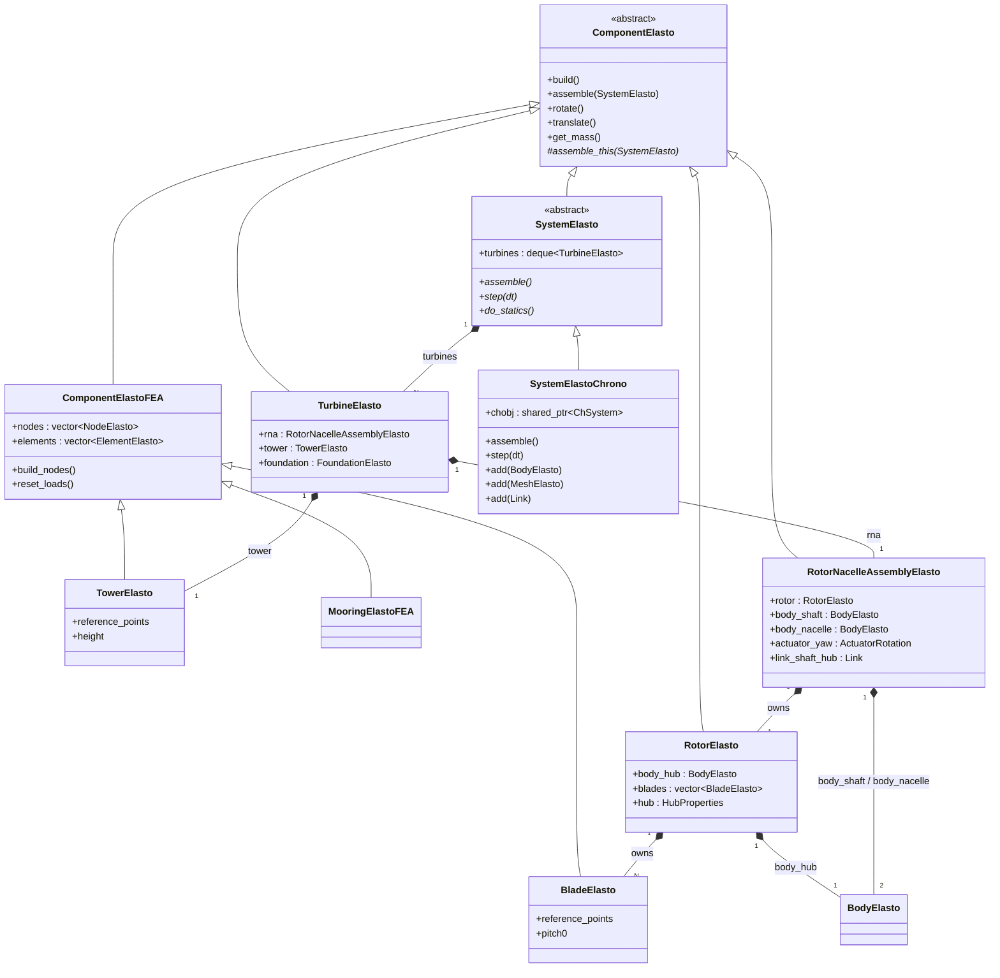
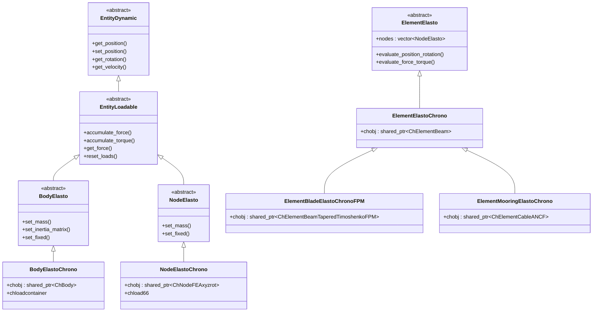
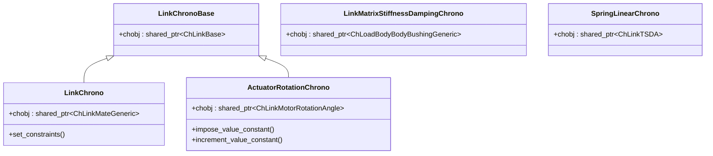
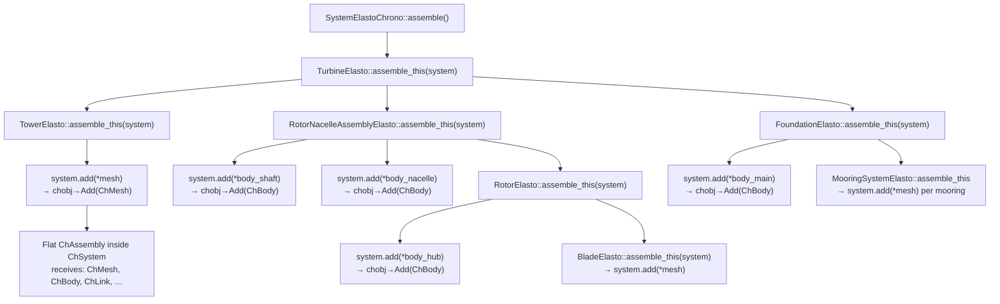
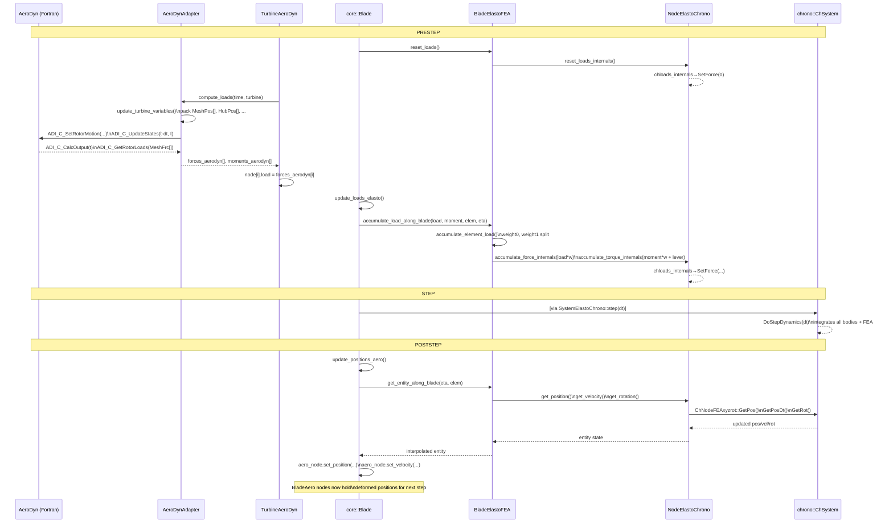

# SEAHOWL ↔ Chrono Interface

SEAHOWL uses [Project Chrono](https://projectchrono.org) as its elastodynamic solver backend.
The integration is handled exclusively through the `elasto` module — the `core` and `fluid` modules
never hold a Chrono dependency.

The key design principle is that **SEAHOWL and Chrono operate on two separate hierarchies**:

- SEAHOWL owns a **semantic, hierarchical model** (`TurbineElasto` → `TowerElasto` → nodes/elements …)
  that carries structural meaning and drives the simulation workflow.
- Chrono owns a **flat physics model** (`ChSystem` → `ChAssembly` → list of `ChPhysicsItem`s)
  that is responsible only for time-integration.

`ChAssembly` is a Chrono-internal concept (a flat container of `ChPhysicsItem`s).  
SEAHOWL **never touches `ChAssembly` directly** — all registration goes through
`SystemElastoChrono::add()`, which calls `ChSystem::Add()` internally.

---

## Class Hierarchies

There are three parallel class trees in the `elasto` module.

### 1 — Component hierarchy (structural semantics)

Components are Seahowl objects that organise which structural members exist and how they relate
to one another. They drive `build()`, `assemble()`, `presetup()`, and `reset_loads()` operations
down the tree.



### 2 — Entity hierarchy (individual physics DOFs)

Entities are the individual kinematic objects: rigid bodies and FEA nodes.
Each abstract base class has exactly one concrete Chrono implementation.



### 3 — Link / actuator hierarchy (kinematic constraints)



---

## Object Combination Table

The table below maps every SEAHOWL elasto class to the Chrono object(s) it introduces.
Classes with no `chobj` are **pure coordinators** — they hold sub-components via `shared_ptr`
but add no Chrono object themselves.

| SEAHOWL class | Has `chobj`? | Chrono object(s) introduced |
|---|---|---|
| `SystemElastoChrono` | yes | `chrono::ChSystem` — the time-integration engine |
| `BodyElastoChrono` | yes | `chrono::ChBody` — one rigid body |
| `NodeElastoChrono` | yes | `chrono::fea::ChNodeFEAxyzrot` — one FEA beam node (6 DOF) |
| `MeshElastoChrono` | yes | `chrono::fea::ChMesh` — container for FEA nodes + elements |
| `ElementBladeElastoChrono` | yes | `chrono::fea::ChElementBeamTaperedTimoshenko` |
| `ElementBladeElastoChronoFPM` | yes | `chrono::fea::ChElementBeamTaperedTimoshenkoFPM` |
| `ElementMooringElastoChrono` | yes | `chrono::fea::ChElementCableANCF` |
| `LinkChrono` | yes | `chrono::ChLinkMateGeneric` — generic 6-DOF constraint |
| `LinkChronoCable` | yes | `chrono::ChLinkBase` subclass — node-to-body pin |
| `LinkMatrixStiffnessDampingChrono` | yes | `chrono::ChLoadBodyBodyBushingGeneric` |
| `ActuatorRotationChrono` | yes | `chrono::ChLinkMotorRotationAngle` + two worker `ChBody`s |
| `SpringLinearChrono` | yes | `chrono::ChLinkTSDA` |
| `TowerElasto` | **no** | via `ComponentElastoFEA`: owns `NodeElastoChrono` + `ElementBladeElastoChronoFPM` |
| `BladeElasto` | **no** | via `ComponentElastoFEA`: owns `NodeElastoChrono` + `ElementBladeElastoChronoFPM` |
| `MooringElastoFEA` | **no** | via `ComponentElastoFEA`: owns `NodeElastoChrono` + `ElementMooringElastoChrono` |
| `RotorElasto` | **no** | one `BodyElastoChrono` (`body_hub`) + links via `BladeElasto` children |
| `RotorNacelleAssemblyElasto` | **no** | two `BodyElastoChrono` (`body_shaft`, `body_nacelle`) + `ActuatorRotationChrono` (yaw) + multiple `LinkChrono` |
| `TurbineElasto` | **no** | nothing directly; delegates entirely to `rna`, `tower`, `foundation` |
| `FloaterElasto` | **no** | one `BodyElastoChrono` (`body_main`) + additional named bodies + `LinkChrono`s |

!!! note "Rotor and RNA have no single Chrono counterpart"
    `RotorElasto` and `RotorNacelleAssemblyElasto` are **coordinator classes** — there is no Chrono
    object that represents "the rotor" or "the RNA" as a whole. Their physical content is expressed
    as a collection of rigid bodies (hub, shaft, nacelle) connected by joints and actuators, all of
    which are registered independently into `ChSystem`.

---

## Assembly: One-Time Registration

During `SystemElastoChrono::assemble()` all SEAHOWL elasto objects are **registered** into Chrono.
This cascade happens once, before the simulation loop starts.



Each `SystemElastoChrono::add(X)` overload does a `dynamic_cast` to unwrap the
concrete Chrono object and calls `chobj->Add(item)` on the `ChSystem`.
From that point on `ChAssembly` (Chrono-internal) owns the physics items as a flat list —
SEAHOWL's hierarchy is no longer visible to Chrono.

---

## Per-Timestep Communication

After assembly, all data exchange between SEAHOWL and Chrono follows the same
**prestep → step → poststep** rhythm every timestep.
Loads travel inward (OpenFAST/driver → Chrono) during prestep; positions and velocities
travel outward (Chrono → OpenFAST/driver) during poststep.

The table below summarises the three moments at the Chrono adapter boundary:

| Moment | Direction | SEAHOWL call | Chrono call |
|---|---|---|---|
| **prestep** | SEAHOWL → Chrono | `node.accumulate_force_internals(f)` | `ChLoadForceTorque::SetForce(f)` |
| **prestep** | SEAHOWL → Chrono | `node.accumulate_torque_internals(t)` | `ChLoadForceTorque::SetTorque(t)` |
| **prestep** | SEAHOWL → Chrono | `body.accumulate_force_internals(f)` | `ChLoadForceTorque::SetForce(f)` |
| **prestep** | SEAHOWL → Chrono | `body.accumulate_force(f)` | `ChBody::AccumulateForce(f)` |
| **step** | SEAHOWL triggers | `SystemElastoChrono::step(dt)` | `ChSystem::DoStepDynamics(dt)` |
| **poststep** | Chrono → SEAHOWL | `node.get_position()` | `ChNodeFEAxyzrot::GetPos()` |
| **poststep** | Chrono → SEAHOWL | `node.get_velocity()` | `ChNodeFEAxyzrot::GetPosDt()` |
| **poststep** | Chrono → SEAHOWL | `body.get_position()` | `ChBody::GetPos()` |
| **poststep** | Chrono → SEAHOWL | `link.get_reaction_force()` | `ChLinkMateGeneric::GetReaction2()` |

The sections below detail how these calls are reached across all five layers of the stack,
from the external solver (AeroDyn, HydroDyn) down to the individual Chrono object.

---

## Data Exchange: Full End-to-End Flow

### Overview

Every timestep the stack crosses five layers in each direction:

```
Layer 1  OpenFAST C-binding    (AeroDynInflowLib / HydroDynLib)
Layer 2  Fluid adapter         (TurbineAeroDyn / FloaterHydroDyn)
Layer 3  Core mediator         (core::Blade / core::Floater)
Layer 4  Elasto component      (BladeElastoFEA / FloaterElasto)
Layer 5  Chrono adapter        (NodeElastoChrono / BodyElastoChrono)
```

Loads descend from layer 1 → 5 during **prestep**; positions/velocities ascend from
layer 5 → 1 during **poststep**.

---

### PRESTEP — Load path (OpenFAST → Chrono)

#### Layer 1 — AeroDyn C-binding: positions out, loads in

`AeroDynAdapter::compute_loads()` first packs the current structural state
into flat `float[]` / `double[]` arrays and sends them to AeroDyn via the C-binding:

| Array sent to AeroDyn | Source in SEAHOWL | OpenFAST C function |
|---|---|---|
| `HubPos[3]`, `HubOri[9]`, `HubVel[6]`, `HubAcc[6]` | `body_hub.get_position/rotation/velocity/acceleration()` | `ADI_C_SetRotorMotion` |
| `NacPos[3]`, `NacOri[9]`, `NacVel[6]`, `NacAcc[6]` | `body_nacelle.get_position/…()` | `ADI_C_SetRotorMotion` |
| `BldRootPos[3N]`, `BldRootOri[9N]`, `BldRootVel[6N]`, `BldRootAcc[6N]` | `blade->body_root->get_position/…()` per blade | `ADI_C_SetRotorMotion` |
| `MeshPos[3M]`, `MeshOri[9M]`, `MeshVel[6M]`, `MeshAcc[6M]` | `blade_aero->nodes[j].get_position/…()` per node | `ADI_C_SetRotorMotion` |

After sending motion, AeroDyn integrates its states and computes aerodynamic loads:

```
ADI_C_SetRotorMotion(...)   → AeroDyn receives structural positions
ADI_C_UpdateStates(t-dt, t) → AeroDyn advances its internal states
ADI_C_CalcOutput(t)         → AeroDyn evaluates loads at current state
ADI_C_GetRotorLoads(MeshFrc[6*M]) → returns force+moment per mesh node
```

The raw output is unpacked into `AeroDynAdapter::forces_aerodyn[]` and `moments_aerodyn[]`
(one `Vector3d` pair per aero node across all blades).

#### Layer 2 — Fluid adapter deposits loads onto aero nodes

`TurbineAeroDyn::compute_env_loads()` copies the unpacked loads onto the fluid
discretization objects:

```cpp
// for each blade, for each aero node:
node.load   = forces_aerodyn[count_node];
node.moment = moments_aerodyn[count_node];
```

Loads are now on `BladeAero::nodes[i]` — still on the fluid side, using the aero discretization.

#### Layer 3 — Core mediator maps aero grid → FEA grid

`core::Blade::prestep()` calls `update_loads_elasto()`.
This iterates over aero *elements* (midpoints between aero nodes) and maps each one
to the corresponding FEA element using a precomputed index-and-eta mapping:

```cpp
// mapping_fluid2elasto_elements[ii] computed once at initialize()
elasto.accumulate_load_along_blade(
    aero.elements[ii].get_load(),
    aero.elements[ii].get_moment(),
    mapping_fluid2elasto_elements[ii].index,   // FEA element index
    mapping_fluid2elasto_elements[ii].eta,     // position along element [-1, +1]
    aero.elements[ii].get_offset_aero_absolute()
);
```

#### Layer 4 — FEA component splits load to two bounding nodes

`ComponentElastoFEA::accumulate_element_load()` distributes the element load to its
two `NodeElasto` endpoints using a linear weight based on `eta`:

```
weight0 = 0.5 * |eta - 1|    (fraction to node 0, the "near" end)
weight1 = 0.5 * |eta + 1|    (fraction to node 1, the "far" end)
```

Each node receives a force and a torque that includes a lever-arm correction for the
offset between the load application point and the node position:

```cpp
node0->accumulate_force_internals(load * weight0, false);
node0->accumulate_torque_internals(
    moment * weight0 + (load_position - node0_position).cross(load * weight0), false);
// same pattern for node1
```

#### Layer 5 — Chrono adapter writes into Chrono

`NodeElastoChrono::accumulate_force_internals()` updates the `ChLoadForceTorque`
object (`chloads_internals`) that lives inside a `ChLoadContainer` registered with `ChSystem`:

```cpp
chloads_internals->SetForce(chloads_internals->GetForce() + force);
```

The force is now inside Chrono's physics system and will be applied on the next
`DoStepDynamics` call.

---

### PRESTEP — Rigid body loads (controller and hydrodynamics)

Rigid bodies (`BodyElastoChrono` / `ChBody`) use two parallel load channels:

**External generic forces** — go directly into `ChBody` accumulators:

```cpp
// BodyElastoChrono::accumulate_force()
chobj->AccumulateForce(force, chobj->GetPos(), is_local);
// BodyElastoChrono::accumulate_torque()
chobj->AccumulateTorque(torque, is_local);
```

Reset by `chobj->EmptyAccumulators()` (called by `reset_loads()`).

**Internal fluid/control forces** — go into a separate `ChLoadForceTorque` (`chloads_internals`),
identical in mechanism to FEA nodes:

```cpp
// BodyElastoChrono::accumulate_force_internals()
chloads_internals->SetForce(chloads_internals->GetForce() + force);
```

Reset by `chloads_internals->SetForce({0,0,0})` (called by `reset_loads_internals()`).

The specific internal loads applied each prestep are:

| Load | Applied on | Source |
|---|---|---|
| Hydrodynamic force + torque | `body_main` (floater) | `FloaterHydro::get_force_hydro/torque_hydro()` |
| Electrical generator torque (−) | `body_hub` | `controller->get_torque_elec() × gearbox_ratio` |
| Electrical generator torque (+) | `body_shaft` | same value, opposite sign |
| Gearbox loss torque | `body_hub` | `−aero_torque × (1 − gearbox_efficiency)` |
| Added mass matrix | `body_main` (floater) | `FloaterHydro::get_added_mass_matrix()` → `ChLoadLocal66` |

!!! note "Why two channels?"
    The split between external (`AccumulateForce`) and internal (`chloads_internals`)
    allows SEAHOWL to track fluid and control contributions separately for output
    purposes, while both channels are summed by Chrono during `DoStepDynamics`.

---

### STEP

```
SystemElastoChrono::step(dt)
  └── chobj->DoStepDynamics(dt)
```

Chrono integrates all `ChBody`, `ChMesh`, `ChLink`, and `ChLoadContainer` items.
All accumulated forces (both channels for bodies, `ChLoadForceTorque` for nodes) are applied.
After this call, positions, velocities, and accelerations of all Chrono objects are updated.

---

### POSTSTEP — Position path (Chrono → OpenFAST)

#### Layer 5 — Chrono adapter reads back from Chrono

```cpp
// NodeElastoChrono
get_position()     → chobj->GetPos()
get_rotation()     → chobj->GetRot()
get_velocity()     → chobj->GetPosDt()
get_acceleration() → chobj->GetPosDt2()

// BodyElastoChrono
get_position()     → chobj->GetPos()
get_velocity()     → chobj->GetPosDt()
```

#### Layer 5 — Link reactions read from Chrono

`LinkChrono::get_reaction_force/torque()` reads Lagrange multiplier reactions
computed by Chrono during `DoStepDynamics`:

```cpp
auto wrench = chobj->GetReaction2();   // ChLinkMateGeneric
return ch2vec(wrench.force / wrench.torque);
```

These are used by SEAHOWL for output quantities only — not fed back into the load path:

| Link | What SEAHOWL reads |
|---|---|
| `BladeElasto::link_root` | blade root force and moment |
| `BladeElasto::link_blade` | blade-hub constraint reaction |
| `RotorNacelleAssemblyElasto::link_shaft_hub` | shaft axial torque and thrust |
| `MooringElasto::link_*` | mooring fairlead tension |

#### Layer 4 — FEA component interpolates along elements

`BladeElastoFEA::get_entity_along_blade(eta, element_index)` interpolates
position, rotation, and velocity at any point along a FEA beam element from
the two bounding `NodeElastoChrono` objects.

#### Layer 3 — Core mediator maps FEA grid → aero grid

`core::Blade::poststep()` calls `update_positions_aero()`.
For each aero node, it looks up `mapping_fluid2elasto_nodes[ii]` and reads the
interpolated state from the FEA side:

```cpp
auto entity = elasto.get_entity_along_blade(
    mapping_fluid2elasto_nodes[ii].eta,
    mapping_fluid2elasto_nodes[ii].index);

aero_node.set_position(entity.get_position() + aero_node.get_offset_aero_absolute());
aero_node.set_rotation(entity.get_rotation());
aero_node.set_velocity(entity.get_velocity());
aero_node.set_rotational_velocity(entity.get_rotational_velocity());
aero_node.set_acceleration(entity.get_acceleration());
```

The blade root rigid body (`body_root`) on the fluid side is also synced from
`elasto.actuator_pitch->body_worker`.

For `core::Floater::poststep()`, the single `body_main` position is copied directly:

```cpp
hydro.body_main->set_position(elasto.body_main->get_position());
hydro.body_main->set_velocity(elasto.body_main->get_velocity());
// + rotation, rotational_velocity, acceleration
```

#### Layer 2 — Fluid adapter nodes now hold updated state

`BladeAero::nodes[i]` and `FloaterHydro::body_main` now contain the deformed positions
and velocities from the latest Chrono step. No explicit call is needed here —
the state was written in layer 3.

#### Layer 1 — Next prestep re-packs updated state into AeroDyn arrays

At the start of the next prestep, `AeroDynAdapter::update_mesh_motion()` reads
from the updated `BladeAero::nodes[i]` and packs them back into `pImpl->MeshPos[]`,
`MeshVel[]`, etc., closing the loop.

---

### Full sequence diagram (blade aero path)



---

### Load mechanism summary by Chrono object type

| Chrono object | Load input mechanism | Reset | Read-back after step |
|---|---|---|---|
| `ChNodeFEAxyzrot` | `chloads_internals` (`ChLoadForceTorque`) via `accumulate_force_internals` | `SetForce(0)` | `GetPos()`, `GetPosDt()`, `GetRot()` |
| `ChBody` — external | `ChBody::AccumulateForce/Torque` | `EmptyAccumulators()` | `GetPos()`, `GetPosDt()` |
| `ChBody` — internal (fluids/control) | `chloads_internals` (`ChLoadForceTorque`) | `SetForce(0)` | — |
| `ChBody` — added mass | `ChLoadLocal66::SetAddedMassMatrix` | set each step | — |
| `ChLinkMateGeneric` | none — constraint only, no load input | n/a | `GetReaction2().force/.torque` |

---

## HydroChrono: The Exception

`FloaterHydroChrono` (in `seahowl/fluid/hydro/hydrochrono_adapter.h`) is the one class
that deliberately crosses the elasto/fluid boundary: it inherits **`FloaterElasto`**, not a fluid class.

This means hydrodynamic loads for the potential-flow floater are computed **inside Chrono** itself
(via the HydroChrono library, which attaches directly to `ChBody`).
No fluid-to-elasto load transfer is needed at the core mediator level for this backend —
the wave forces are already applied to `ChBody` by the time SEAHOWL's `prestep` runs.

---

## Potential Improvement: Tighter FSI Coupling via the HydroChrono Pattern

### Current limitation — staggered coupling

SEAHOWL currently uses a **staggered (weakly coupled) scheme** for aerodynamic and hydrodynamic
loads. The consequence is:

1. At `prestep`, SEAHOWL calls AeroDyn / HydroDyn once and freezes the resulting loads as constant
   `load_Q` vectors inside `ChLoadForceTorque`.
2. Chrono's HHT Newton-Raphson loop (`Increment()`) then iterates to convergence **without
   updating the fluid loads** — `ComputeQ()` on `ChLoadForceTorque` simply re-copies the same
   stored values each iteration.
3. The structural deformation from step 2 is fed back to the fluid solver only at the next
   timestep's `prestep`.

This means the coupling error is $O(\Delta t)$ — first-order in time. For large timesteps or
strongly coupled problems (e.g., near-resonance, large motions), this staggering can introduce
numerical damping or amplitude errors.

### What HydroChrono does differently

`FloaterHydroChrono` avoids this by registering hydrodynamic loads **as native Chrono loads**
(via load classes that hook directly into `ChLoadBodyBodyBushingGeneric` or equivalent Chrono
stiff-load mechanisms). Because these loads are Chrono-native, their `ComputeQ()` and Jacobians
are evaluated at the **current Newton iterate** `(Xnew, Vnew)` each inner iteration — not once per
timestep. This makes the hydro-structure coupling **implicitly consistent** within each timestep.

### Applying the same pattern to aerodynamics (SEA-Stack integration)

To achieve the same level of implicit coupling for aerodynamic and mooring loads, the
`ChLoadForceTorque` approach would need to be replaced with a Chrono load class that calls the
fluid solver at each Newton iteration. The integration path would be:

```
ChLoadCustom-derived class
  └── ComputeQ(state_x, state_w)
        ├── unpack positions/velocities from state_x / state_w
        ├── call AeroDyn (or surrogate) for updated loads at current iterate
        └── write result into load_Q
```

!!! note "IsStiff() and Jacobians"
    For full Newton consistency, the derived class should also set `IsStiff() = true` and
    implement `ComputeJacobian()` (or accept finite-difference approximations). This causes Chrono
    to include $-\partial Q / \partial x$ and $-\partial Q / \partial v$ in the tangent stiffness
    matrix assembled each iteration, which is essential for unconditional stability of the
    implicit scheme.

### Trade-offs

| Aspect | Current staggered scheme | Implicit (HydroChrono-style) |
|---|---|---|
| AeroDyn calls per timestep | 1 | N (one per Newton iteration) |
| Coupling accuracy | $O(\Delta t)$ | $O(\Delta t^2)$ or better |
| Jacobian of fluid loads available | No | Required for full benefit |
| Timestep size constraint | Stricter (stability) | Relaxed |
| Implementation complexity | Low | High (need differentiable or surrogate fluid) |

For SEA-Stack integration, the preferred path would be to implement a
`ChLoadAeroDynFSI`-style class that wraps the AeroDyn C-binding inside `ComputeQ`, replacing
the current `ChLoadForceTorque`. The existing five-layer architecture (fluid adapter →
core mediator → elasto component → Chrono adapter) would remain valid; only the innermost
Chrono load object and its evaluation timing would change.

---

## Coordinate System Conventions

Chrono and the IEC wind-turbine standard (used by SEAHOWL for blades) define different axis
orientations for beam nodes. Conversion functions in `chrono_adapters.cpp` handle this transparently:

| Convention | x-axis | y-axis | z-axis |
|---|---|---|---|
| IEC (SEAHOWL blade) | flapwise → nacelle | edgewise → trailing edge | longitudinal → tip |
| Chrono beam node | longitudinal → tip | edgewise → trailing edge | flapwise → away from nacelle |

The transform is a **+90° rotation around the y-axis** (IEC → Chrono) applied to both
positions (`vec_iec2ch`) and quaternions (`node_iec2ch`) when writing to Chrono,
and **−90°** (Chrono → IEC) when reading back.
