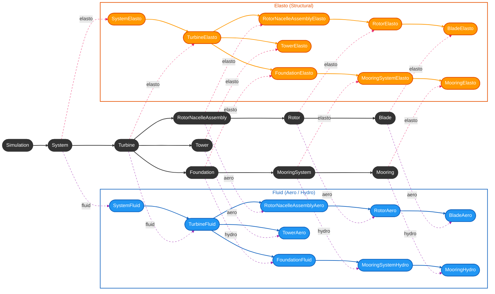

# Core Component Workflow

## Core Design Pattern: Mediator

Core components act as **mediators** between physics domains with different discretizations. Each physics components such as elasto or fluid (aero/hydro) are completely partitioned and do not know of the existence of each other (e.g. no elasto-related #include on the fluid side). Only core components have access to all physics at once and take care of transfering loads and/or positions across physics. With this strong partition, it is possible to build an elasto-only case (e.g. for blade decay test), or to switch fidelity-level only on one side of the physics (e.g. `Blade` logic remains untouched whether it deals with `BladeElastoFEA` or with `BladeElastoRigid`)

Core components deal with abstract objects that have generic functions. For example, a core `Blade` instance deals with `BladeAero` and `BladeElasto` and their abstract functions (without the need to know if the concrete elasto blade instance is `BladeElastoRigid` or `BladeElastoFEA`). Similarly, a `Rotor` instance deals with `RotorElasto` and `RotorAero` and their abstract functions (without the need to know if the concrete aero rotor instance is `RotorAeroBEMT` or `RotorAeroDyn`). This allows for switching easily between individual physics solver or fidelity level for individual components.

## Flowchart




## Making a new core component

All core components are derived from the `ComponentDynamic` abstract base class. As such, they must implement the `build`, `initialize`, `prestep`, and `poststep` methods. This allows any concrete core component to be added to a `System` as a `ComponentDynamic` (shared pointer) and it will be automatically handled abstractly during the setup phase (by calling `build` and `initialize`) and during the simulation loop (by calling `prestep` and `poststep`).

## Setup workflow of core components

### Building phase

When `build()` is called on a core component, it calls `build()` on its elasto and fluid counterparts and this `build()` call cascades down to the last component on the elasto and fluid sides.

For example, if `build()` is called on a `Turbine`, it calls `build()` on `TurbineElasto` and `TurbineFluid` separately. From `TurbineElasto`, `build()` is called sequentially on `RotorNacelleAssemblyElasto`&rarr;`RotorElasto`&rarr;`BladeElasto`, then `TowerElasto`, and `FoundationElasto` (also &rarr;`MooringSystemElasto`&rarr;`MooringElasto` if foundation is a floater).

```
Turbine::build()
│
├── TurbineElasto::build()
│   ├── RotorNacelleAssemblyElasto::build()
│   │   └── RotorElasto:build()
│   │       └── BladeElasto::build()
│   ├── TowerElasto::build()
│   └── FoundationElasto::build()
│       └── MooringSystemElasto::build()
│           └── MooringElasto::build()
│
└── TurbineFluid::build()
    ├── RotorNacelleAssemblyAero::build()
    │   └── RotorAero:build()
    │       └── BladeAero::build()
    ├── TowerAero::build()
    └── FoundationFluid::build()
        └── MooringSystemHydro::build()
            └── MooringHydro::build()
```


### Initialization phase

When `initialize()` is called on a core component, it updates the fluid (aero/hydro) positions according to the elasto positions after the build step, and before the simulation actually starts. It also precomputes mesh mappings between elasto<->aero components according their individual discretization (e.g. for `Blade` or `Tower`). Anything that must happen before the simulation starts (but after everything is built) must be included in this function.

At the inialization stage, the `initialize()` cascades down to the last core component and will call, if necessary, `initialize()` individually on elasto or fluid component (e.g. this is needed for `RotorAeroDyn` or `FloaterHydroChrono`). For example, if `initialize()` is called on a `Turbine`, it calls `initialize()` sequentially on `RotorNacelleAssembly`&rarr;`Rotor`&rarr;`Blade`, then `Tower`, and `Foundation` (also &rarr;`MooringSystem`&rarr;`Mooring` if foundation is a floater).

```
Turbine::initialize()
│
├── RotorNacelleAssembly::initialize()
│   └── RotorElasto:initialize()
│       └── Blade::initialize()
├── Tower::initialize()
├── Controller::initialize()
└── Foundation::initialize()
    └── MooringSystem::initialize()
        └── Mooring::initialize()
```
