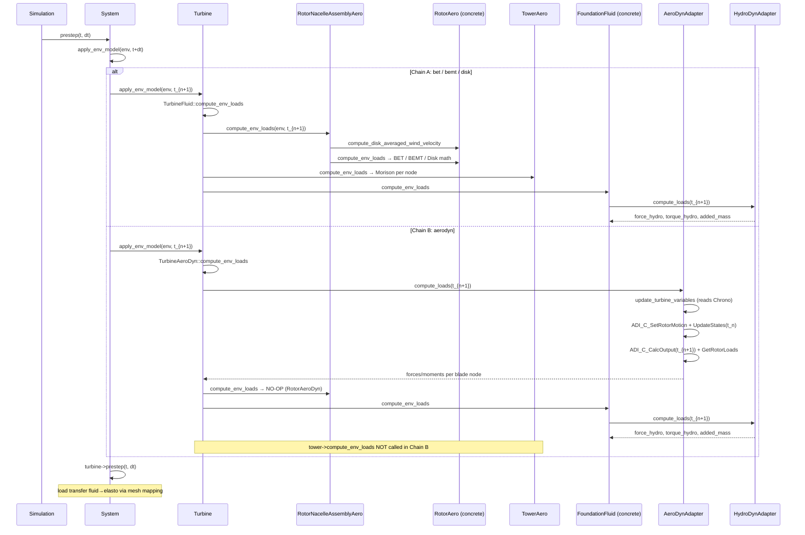

# Prestep: Environmental Load Computation

This document details the call chain executed during the `apply_env_model` phase of each simulation prestep.
It complements the high-level description in [sim-workflow.md](sim-workflow.md) and the OpenFAST interface
analysis in [architecture/seahowl_openfast_interface.md](architecture/seahowl_openfast_interface.md).

---

## Position in the Simulation Loop

`System::prestep(time, dt)` orchestrates three distinct operations before each Chrono integration step:

```
System::prestep(time, dt)
│
├─ 1. apply_control(time, dt)          ← controller commands (pitch, torque setpoints)
│
├─ 2. apply_env_model(env, time + dt)  ← THIS DOCUMENT — fluid loads evaluated at t_{n+1}
│
├─ 3. turbine->prestep(time, dt)       ← load transfer: fluid nodes → elasto nodes (mesh mapping)
│      └─ component->prestep(time, dt)
│
└─ 4. apply_soil_model(env, time)      ← soil/mooring loads applied directly to elasto
```

**Key timing note:** Environmental loads are evaluated at `t_{n+1}` (predictive), using the current elasto
positions as they stand at the end of the previous step. This means the fluid models receive node kinematics
at `t_n` but are asked to compute loads for `t_{n+1}`. The Chrono integration at step 3 then advances the
structure using those loads as constant over the timestep.

---

## Entry Point: `System::apply_env_model`

`System::apply_env_model` iterates over two independent collections:

```cpp
// system.cpp:164
void System::apply_env_model(EnvModel& env_model, double time) {
    for (auto& turbine : turbines)      // turbine-attached components
        turbine->apply_env_model(env_model, time);
    for (auto& component : components)  // standalone components (e.g. Floater)
        component->apply_env_model(env_model, time);
}
```

The `aero.solver` field in the turbine JSON selects the concrete `TurbineFluid` subtype at load time
(`read_input.cpp:673`), which determines which `compute_env_loads` implementation is called via C++ virtual
dispatch. The two resulting call chains are described below.

---

## Chain A — Native SEAHOWL Solvers (bet / bemt / disk)

Activated when `aero.solver` is `"bet"`, `"bemt"`, or `"disk"`.

```
Turbine::apply_env_model(env, t_{n+1})          [turbine.cpp]
  └─ fluid.compute_env_loads(env, t_{n+1})       ← virtual dispatch → TurbineFluid
       │
       ├─ rna->compute_env_loads(env, t_{n+1})   [rotor_aero.cpp]
       │    ├─ rotor->compute_disk_averaged_wind_velocity(env, t_{n+1})
       │    │    └─ averages wind velocity at hub + all blade nodes from EnvModel
       │    └─ rotor->compute_env_loads(env, t_{n+1})   ← virtual dispatch (4 targets)
       │         ├─ RotorAeroBET::compute_env_loads     → delegates to blade->compute_env_loads per blade
       │         ├─ RotorAeroBEMT::compute_env_loads    → inline BEMT per node (tip/hub loss, tower shadow)
       │         ├─ RotorAeroDisk::compute_env_loads    → Cp/Ct table lookup at hub level
       │         └─ RotorAeroDyn::compute_env_loads     → NO-OP (see Chain B)
       │
       ├─ tower->compute_env_loads(env, t_{n+1}) → per-node Morison equation (see §Tower)
       │
       └─ foundation->compute_env_loads(env, t_{n+1})   ← virtual dispatch
            ├─ FloaterHydroDyn::compute_env_loads       → HydroDyn C API (see §HydroDyn)
            ├─ MonopileHydroDyn::compute_env_loads      → HydroDyn C API (distributed)
            └─ FloaterHydroChrono::compute_env_loads    → handled via HydroChrono time integration
```

### Rotor solver selection

The concrete rotor type is assigned once at input parsing (`read_input.cpp:236`) from the `aero.solver` JSON field:

| `aero.solver` | Concrete type assigned | Physics |
|---|---|---|
| `"bet"` | `RotorAeroBET` | Blade Element Theory; delegates per-node load to `BladeAero::compute_env_loads` |
| `"bemt"` | `RotorAeroBEMT` | Blade Element Momentum Theory; computes BEMT inline per node with axial/tangential induction, tip/hub loss, optional tower shadow |
| `"disk"` | `RotorAeroDisk` | Actuator disk; Cp/Ct bilinear table lookup from (TSR, pitch); no blade discretization |
| `"aerodyn"` | `RotorAeroDyn` | NO-OP in Chain A; active only through `TurbineAeroDyn` in Chain B |

**Note:** `RotorAeroBET` and `RotorAeroBEMT` both inherit from `RotorAeroBET`, but `RotorAeroBEMT` overrides
`compute_env_loads` completely — it does **not** call `BladeAero::compute_env_loads`. The BEMT algorithm
works directly on `BladeNodeAero` objects, accumulating induction factors across iterations internally.

---

## Chain B — AeroDyn Solver

Activated when `aero.solver == "aerodyn"` (requires `HAVE_AERODYN` compile flag).

```
Turbine::apply_env_model(env, t_{n+1})            [turbine.cpp]
  └─ fluid.compute_env_loads(env, t_{n+1})         ← virtual dispatch → TurbineAeroDyn
       │
       ├─ aerodyn.compute_loads(t_{n+1}, *this)    [aerodyn_adapter.cpp]
       │    ├─ SetTime(t_{n+1}, t_n)               ← note reversed time order vs HydroDyn (see §Time conventions)
       │    ├─ update_turbine_variables(*this)      ← reads current kinematics from Chrono objects
       │    │    ├─ update_hub_motion(turbine)
       │    │    ├─ update_nacelle_motion(turbine)
       │    │    ├─ update_roots_motion(turbine)    ← blade root positions/orientations
       │    │    └─ update_mesh_motion(turbine)     ← blade section node positions/velocities
       │    ├─ Update:
       │    │    ├─ ADI_C_SetRotorMotion(...)       ← pass kinematics into AeroDyn
       │    │    └─ ADI_C_UpdateStates(t_n, ...)    ← advance AeroDyn internal states from t_n
       │    └─ Calcul:
       │         ├─ ADI_C_CalcOutput(t_{n+1}, ...) ← compute aerodynamic loads at t_{n+1}
       │         ├─ ADI_C_GetRotorLoads(...)        ← retrieve forces/moments per blade node
       │         └─ ADI_C_GetDiskAvgVel(...)        ← retrieve disk-averaged wind velocity
       │
       ├─ load transfer: aerodyn.forces/moments → rotor.blades[i].nodes[j].load/moment
       │
       ├─ rna->compute_env_loads(env, t_{n+1})     ← RotorAeroDyn overrides both sub-calls as NO-OP
       │    ├─ rotor->compute_disk_averaged_wind_velocity  → NO-OP (RotorAeroDyn)
       │    └─ rotor->compute_env_loads                   → NO-OP (RotorAeroDyn)
       │
       ├─ rna->rotor->disk_averaged_wind_velocity = aerodyn.disk_averaged_velocity
       │
       └─ foundation->compute_env_loads(env, t_{n+1})     ← same path as Chain A
            └─ FloaterHydroDyn::compute_env_loads / MonopileHydroDyn (see §HydroDyn)
```

**Tower loads in Chain B:** `TurbineAeroDyn::compute_env_loads` does **not** call
`tower->compute_env_loads`. Tower aerodynamic loads are handled internally by the AeroDyn/InflowWind library.
SEAHOWL's `TowerAero` Morison model is therefore bypassed entirely when AeroDyn is active.

**Design note:** The `rna->compute_env_loads` call in Chain B is functionally redundant — both of its
sub-calls dispatch to no-op overrides in `RotorAeroDyn`. It exists for structural symmetry with Chain A and
as a potential hook if RNA-level non-rotor logic is added in the future. The `dynamic_cast<RotorAeroDyn&>`
used to access blade nodes for the load transfer is a known abstraction leak (see open questions).

---

## Tower Load Computation — Morison Equation

`TowerAero::compute_env_loads` iterates over every discretized tower node and calls
`MorisonNode::compute_env_loads`. The tower model covers only the **above-water portion** of the structure.
There is no explicit guard preventing node overlap with a Monopile or Floater foundation; care must be taken
in the input definition to avoid double-counting.

For each tower node the following sequence is executed:

```
MorisonNode::compute_env_loads(env, t_{n+1})
│
├─ Initialize loads and added-mass matrix to zero
├─ Read node kinematics (position, velocity, acceleration) from Chrono body
├─ Query fluid state (velocity, density) from EnvModel
│    └─ velocity set to zero if node is above the active fluid domain
├─ Compute relative velocity = fluid velocity − node velocity
├─ Decompose into axial (along node axis) and normal (transverse) components
├─ Compute drag force: F_drag = 0.5 · ρ · Cd · D · |v_rel_n| · v_rel_n  (per unit length)
├─ Compute inertia / added-mass force:
│    ├─ Compute absolute fluid acceleration (from EnvModel)
│    ├─ Compute relative acceleration = fluid acceleration − node acceleration
│    └─ F_inertia = ρ · Cm · A · a_fluid + ρ · Ca · A · a_rel         [TODO: verify with §195–215 morison.cpp]
├─ Sum loads: node.load = (F_drag + F_inertia) · element_length
└─ Compute buoyancy force (hydrostatic pressure on submerged volume)
```

> **TODO / hypothesis:** The split between absolute and relative acceleration in the inertia term
> (lines 195–215 of `morison.cpp`) needs physics review. The standard Morison equation uses
> $F = \rho C_m A \ddot{u}_f - \rho C_a A (\ddot{x} - \ddot{u}_f)$ where $\ddot{u}_f$ is the fluid
> particle acceleration and $\ddot{x}$ is the structure acceleration. Verify sign convention and
> whether $C_m = 1 + C_a$ is enforced.

---

## HydroDyn Load Computation

`FloaterHydroDyn::compute_env_loads` wraps the OpenFAST HydroDyn C API:

```
FloaterHydroDyn::compute_env_loads(env, t_{n+1})
│
├─ FloaterHydro::compute_env_loads(env, t_{n+1})   ← base: computes mooring forces (if any)
│
├─ hydrodyn->compute_loads(t_{n+1}, bodies)
│    ├─ interface_hydrodyn->set_time(t_{n+1})       ← sets (t_{n+1}, t_{n+2}) window
│    ├─ update_nodes_motion(nodes)                  ← transfers node kinematics from Chrono; no predictor
│    ├─ Update: HydroDyn_C_UpdateStates(t_{n+1}, t_{n+2}, ...)
│    └─ Calcul: HydroDyn_C_CalcOutput_and_AddedMass(t_{n+1}, ...)
│
├─ force_hydro  = hydrodyn->forces_hydrodyn[0]
├─ torque_hydro = hydrodyn->moments_hydrodyn[0]
├─ added_mass_matrix = hydrodyn->added_mass_matrix
└─ added_mass_matrix = R⁻¹ · added_mass_matrix     ← rotate from global to local frame
```

The transferred `force_hydro` and `torque_hydro` are applied to the elasto body in
`Floater::prestep` → `update_loads_elasto()`:

```cpp
elasto.body_main->accumulate_force_internals(hydro.get_force_hydro(), false);
elasto.body_main->accumulate_torque_internals(hydro.get_torque_hydro(), false);
elasto.body_main->set_added_mass_matrix(hydro.get_added_mass_matrix());
```

The added-mass matrix is handled separately from the force/torque because Chrono requires it to modify
the effective inertia during the integration step itself.

---

## Time Convention Comparison: AeroDyn vs HydroDyn

Both modules follow OpenFAST's standard `UpdateStates` / `CalcOutput` split, but with a different
time window orientation as called from SEAHOWL:

| | AeroDyn (Chain B) | HydroDyn (Chains A & B) |
|---|---|---|
| `set_time` / `SetTime` | `(t_{n+1}, t_n)` | `(t_{n+1})` → window `(t_{n+1}, t_{n+2})` |
| `UpdateStates` called at | `t_n` → advances to `t_{n+1}` | `t_{n+1}` → advances to `t_{n+2}` |
| `CalcOutput` called at | `t_{n+1}` | `t_{n+1}` |
| Node kinematics source | Chrono (current step) | Chrono (current step, no predictor) |

> **TODO / hypothesis:** The reversed time argument order in the AeroDyn `SetTime(t_{n+1}, t_n)` call
> (time_next before time_current) may follow the ADI C-bind API signature rather than a different
> physical convention. Verify against the AeroDyn C-binding header to confirm argument ordering.

---

## Full Sequence Diagram



---

## Component Responsibility Summary

| Class | File | Role in `apply_env_model` |
|---|---|---|
| `System` | `src/core/system.cpp` | Orchestrates turbines + standalone components |
| `Turbine` | `src/core/turbine.cpp` | Delegates to `fluid.compute_env_loads` (virtual) |
| `TurbineFluid` | `src/fluid/aero/turbine_aero.cpp` | Chain A: orchestrates RNA + tower + foundation |
| `TurbineAeroDyn` | `src/fluid/aero/aerodyn_adapter.cpp` | Chain B: calls AeroDyn first, then RNA (no-op), then foundation |
| `RotorNacelleAssemblyAero` | `src/fluid/aero/rotor_aero.cpp` | Delegates to `rotor` (disk-avg wind + loads) |
| `RotorAeroBET` | `src/fluid/aero/rotor_aero.cpp` | BET: calls `BladeAero::compute_env_loads` per blade |
| `RotorAeroBEMT` | `src/fluid/aero/rotor_aero.cpp` | BEMT: inline per-node computation with induction, overrides BET |
| `RotorAeroDisk` | `src/fluid/aero/rotor_aero.cpp` | Actuator disk: Cp/Ct table lookup at hub level only |
| `RotorAeroDyn` | `src/fluid/aero/aerodyn_adapter.cpp` | NO-OP; loads pre-populated by `TurbineAeroDyn` |
| `BladeAero` | `src/fluid/aero/blade_aero.cpp` | BET (no induction) per blade node; only reached via `RotorAeroBET` |
| `TowerAero` | `src/fluid/aero/tower_aero.cpp` | Morison equation per tower node; skipped in Chain B |
| `FloaterHydroDyn` | `src/fluid/hydro/hydrodyn_adapter.cpp` | Calls HydroDyn C API; returns force + added mass |
| `MonopileHydroDyn` | `src/fluid/hydro/hydrodyn_adapter.cpp` | Same API, distributed across discretized nodes |
| `Floater` | `src/core/floater.cpp` | If standalone in `System::components`: only calls moorings via `apply_env_model`; hydro loads read in `prestep` |

---

## Open Questions

1. **Architecture debt — redundant `rna->compute_env_loads` in Chain B.**
   The call dispatches to two no-ops in `RotorAeroDyn`. The `dynamic_cast<RotorAeroDyn&>` used to access
   blade nodes for the load transfer is an abstraction leak: `TurbineAeroDyn` must know the concrete type
   it created. A cleaner design would expose a `receive_precomputed_loads(forces, moments)` method on
   `RotorAero`, eliminating both the cast and the no-op calls.

2. **Tower node overlap with foundation.**
   `TowerAero` covers the above-water structure with no guard against overlapping with a Monopile or Floater
   foundation. Input files must manually ensure no double-counting of loads in the transition zone.
   In Chain B this is moot (tower is skipped), but in Chain A it is a user responsibility.

3. **Morison inertia term physics (morison.cpp lines 195–215).**
   The exact formulation of the acceleration-dependent load (added mass + fluid inertia term) needs
   verification against the standard Morison equation. In particular: whether $C_m = 1 + C_a$ is
   enforced, sign conventions for relative vs absolute acceleration, and frame alignment.

4. **Solver scope for SEA-Stack.**
   The native SEAHOWL rotor solvers (BET, BEMT, Disk) exist for standalone use but their fidelity
   management is separate from SEA-Stack's multi-fidelity framework. A design decision is required:

   - *Option A:* Keep all solvers and allow SEA-Stack to select via the existing `aero.solver` field.
   - *Option B:* Route all rotor aerodynamics through AeroDyn exclusively, remove the redundant Chain B
     no-op pattern, and manage fidelity levels within AeroDyn/OpenFAST. This is the preferred approach
     if SEA-Stack is the sole user of this interface, as it simplifies the architecture and avoids
     the abstraction leaks described in point 1.
