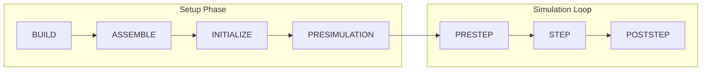

## Flowchart

## Setup Phase

### 1. Build

Each turbine component (blade, tower, floater, mooring, etc.) constructs its internal representations in both the structural (elasto) and fluid (aero/hydro) domains. For example, a Blade creates its BladeElasto finite-element beam model and its BladeAero aerodynamic section model independently.

### 2. Assemble

All structural bodies, FEA meshes, joints, and constraints are registered into the Chrono physics system (SystemElastoChrono). After this phase the complete multi-body/FEA system is fully described but not yet solved. If assemble is not explicitly called, it will be automatically called at the beginning of the Initialize phase.

### 3. Initialize

Mappings between the elasto and fluid discretizations are computed (the two domains generally use different node counts and spacing). Initial positions are synchronized across domains, controllers are connected, and environmental models (wind, waves, soil) are set up.

### 4. Presimulation

An optional settling phase that runs the full PRESTEP→STEP→POSTSTEP cycle without advancing simulation time. Loads are gradually ramped so that structures (cables, mooring lines, floating platforms) can reach static equilibrium before the actual simulation begins. Damping coefficients for blades go linearly from 1.0 at the beginning of the presimulation phase to user-defined coefficients at the end of the presimulation phase. When using moorings, this phase is compulsory as they are initialized with a length equal to the distance between the fairlead and anchor and will linearly stretch to reach their user-defined length at the end of the presimulation phase.

## Simulation Loop

### 1. Prestep

Control actions are applied, environmental loads (aerodynamic, hydrodynamic, soil) are evaluated at current positions, and the resulting forces are transferred from the fluid domain onto the structural nodes. The main functions called on each turbine are (in this order): `Turbine::apply_control(t, dt)` to enforce control commands, `Turbine::compute_env_loads(env, t+dt)` to calculate the environmental loads on the fluid components, and `Turbine::update_loads_elasto()` to transfer those fluid loads to their elasto counterparts through their mesh mapping.

### 2. Step

The elasto solver advances the structural dynamics by one timestep, resolving the equations of motion for all coupled bodies and FEA elements, including demanded control commands such as pitch and yaw applied through rhenomic constraints if actuator dynamics are activated. Essentially, with all the external forces that were defined at the prestep stage, the `DoStepDynamics(dt)` of Project Chrono is called.

### 3. Poststep

Deformed structural positions are mapped back to the fluid domain, the controller poststep is executed (e.g. updating blade pitch or generator torque setpoints), and outputs (CSV, VTK) are written.
