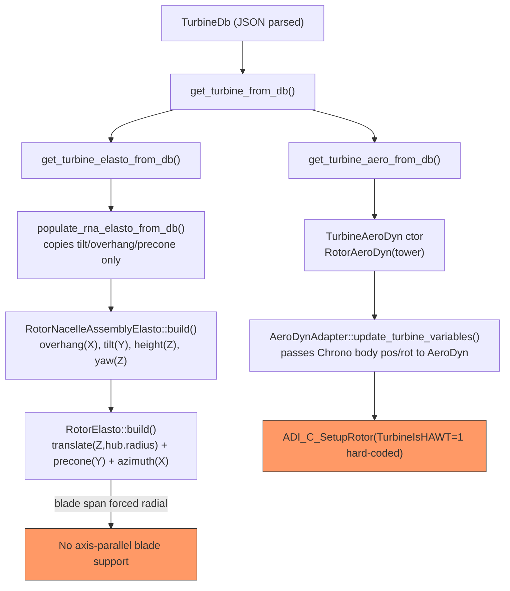

# Vertical Axis Turbines (VAWT) — Feasibility Study

This note documents a read-only investigation into whether SEAHOWL's current
turbine-assembly pipeline can represent a **vertical-axis wind/current turbine**
(VAWT, e.g. a straight-bladed Darrieus / H-rotor), and compares it against the
reference AeroDyn+OLAF vertical-axis driver example
(`ad_VerticalAxis_OLAF`: `ad_driver.dvr`, `AeroDyn.dat`, `AeroDyn_blade.dat`).

**Fact vs. interpretation**: sections below are marked as such. Anything not
directly backed by a citation is flagged `TODO` / `Hypothesis`.

---

## Q1 — How does SEAHOWL currently build a turbine from input data?

**Fact.** The public entry point is
[`get_turbine_from_db`](../../../../src/io/read_input.cpp) in `src/io/read_input.cpp:695`:

```
get_turbine_from_file()                                  (read_input.cpp:840)
 └─ get_turbine_from_db(TurbineDb)                        (read_input.cpp:695)
     ├─ get_turbine_elasto_from_db(TurbineDb)              (read_input.cpp:658)
     │   └─ get_rna_elasto_from_db → populate_rna_elasto_from_db(RnaDb, RotorNacelleAssemblyElasto&)
     │        copies: hub.radius / hub.overhang / hub.position_from_apex,
     │                nacelle.*, shaft.tilt, shaft.distance_from_towertop
     ├─ get_turbine_aero_from_db(TurbineDb)                (read_input.cpp:669)
     │   └─ new TurbineAeroDyn(file_aerodyn_path) → rna->rotor = RotorAeroDyn(tower)
     └─ new core::Turbine(turbine_elasto, turbine_aero)
```

None of these factory functions contain reference-frame logic themselves —
they only copy scalar/vector fields out of the DB structs. The actual
geometric placement (reference-frame construction) happens later, in
`build()`, once the Chrono system is assembled (see Q2).

---

## Q2 — Where is the rotor reference frame actually enforced?

**Fact.** Blade and hub placement is computed in
[`RotorElasto::build()`](../../../../src/elasto/rotor_elasto.cpp) (`src/elasto/rotor_elasto.cpp:28-61`):

```cpp
blade->translate(Vector3d(0.0, 0.0, hub.radius));   // offset along blade-local Z (span axis)
blade->rotate(blade->precone, Vector3d(0.0, 1.0, 0.0)); // precone about Y (IEC edgewise axis)
double azimuth0 = ii * 2 * PI / nblades;
blade->rotate(azimuth0, Vector3d(1.0, 0.0, 0.0));   // uniform spacing about hub-local X (spin axis)
```

and in [`RotorNacelleAssemblyElasto::build()`](../../../../src/elasto/rotor_elasto.cpp) (`src/elasto/rotor_elasto.cpp:152-181`):

```cpp
rotor->translate(Vector3d(rotor->hub.overhang, 0.0, 0.0)); // overhang along local X
rotor->rotate(shaft.tilt, Vector3d(0.0, -1.0, 0.0));       // shaft tilt about Y (small angle only)
rotor->translate(Vector3d(0.0, 0.0, shaft.distance_from_towertop)); // mounted above tower top (Z)
// ... actuator_yaw rotates the RNA about the global Z axis
```

| Rotation / translation | Axis | Purpose | Config field |
|---|---|---|---|
| Blade radial offset | local Z (blade-local, spanwise) | places blade root at `hub.radius` from spin axis | `HubDb.radius` |
| Precone | Y | single scalar cone angle, applied to every blade | `BladeTurbineDb.precone` |
| Azimuth | X (= hub spin axis) | **uniform** spacing `i·2π/N`, not configurable per blade | derived from `blades.size()`, not user-set |
| Overhang | X | shaft offset from tower top | `HubDb.overhang` |
| Shaft tilt | Y | small-angle rotor tilt | `ShaftDb.tilt` |
| Tower-top height | Z | nacelle mounted above tower top | `ShaftDb.distance_from_towertop` |
| Yaw | global Z | wind-tracking mechanism, always instantiated | `RNATurbineDb.initial_yaw` |

**Interpretation.** This formula can only produce blades whose span axis
radiates **outward, perpendicular to the spin axis** ("propeller"/HAWT
topology). There is no additional rotation available to make a blade's span
axis run **parallel to** the spin axis, which is the defining geometric trait
of a straight-bladed VAWT.

Additionally, `RotorNacelleAssembly::get_yaw_error()`
([`include/seahowl/core/rotor.h`](../../../../include/seahowl/core/rotor.h))
explicitly documents that the rotor-disk normal is projected onto the global
X-Y plane, i.e. it assumes a near-horizontal spin axis.

---

## Q3 — Does the input schema expose any per-blade origin/orientation or rotor-axis field?

**Fact.** Grepping `src/io/input_reader_json.cpp` and
`include/seahowl/io/input_structures.h` for `tilt|precone|overhang|shaft|orientation|axis`
shows only:

| Struct | File | Fields |
|---|---|---|
| `ShaftDb` | `include/seahowl/io/input_structures.h:86-90` | `tilt`, `distance_from_towertop` |
| `HubDb` | `include/seahowl/io/input_structures.h:114-121` | `radius`, `position_from_apex`, `overhang`, `mass`, `inertia` |
| `NacelleDb` | `include/seahowl/io/input_structures.h:94-100` | `position_from_towertop`, `mass`, `inertia`, `yaw_bearing_mass` |
| `BladeTurbineDb` | `include/seahowl/io/input_structures.h:274-280` | `file`, `data`, `initial_pitch`, `precone` |

No `"orientation"` or `"axis"` JSON key is parsed anywhere in
`src/io/input_reader_json.cpp` (confirmed by search across the file).

**Interpretation.** The schema has no field equivalent to AeroDyn driver's
`HubOrientation_n`, `BldOrigin_h`, or `BldOrientation_h` (see Q4), so even if
the C++ placement logic were reworked, the JSON input format would need new
fields to describe an arbitrary rotor-axis orientation and per-blade
origin/orientation.

---

## Q4 — How does the AeroDyn/OLAF VAWT reference example define its geometry?

**Fact**, from the external example
`ad_VerticalAxis_OLAF/ad_driver.dvr` and `ad_VerticalAxis_OLAF/AeroDyn.dat`
(outside this repository, provided for comparison):

```
False   HAWTprojection(1)      - True if turbine is a horizontal axis turbine
0,-90,0 HubOrientation_n(1)    - rotations (theta_x,theta_y,theta_z) from nacelle frame to hub frame
NumBlades(1) = 2
0.0819, 0.0860, 0   BldOrigin_h(1_1)      - blade 1 origin in hub coordinates
0.0819,-0.0860, 0   BldOrigin_h(1_2)      - blade 2 origin in hub coordinates
-90,-90,0           BldOrientation_h(1_1) - rotations placing blade 1's span (z) parallel to the hub axis
-90,-90,180         BldOrientation_h(1_2) - rotations placing blade 2's span (z) parallel to the hub axis
3                   Wake_Mod (in AeroDyn.dat) - {0=none,1=BEMT,3=OLAF}
```

Two design choices matter here:

1. **`HubOrientation_n`** reorients the hub frame's spin axis away from the
   nacelle's default (horizontal) axis.
2. **`BldOrientation_h`** is a **full 3-rotation, per-blade** orientation
   (not a single "precone" scalar and a uniformly-spaced "azimuth"), which is
   what actually reorients each blade's span axis to be parallel to the spin
   axis instead of radiating outward from it.

---

## Q5 — Side-by-side comparison

| Aspect | AeroDyn VAWT example | SEAHOWL current implementation |
|---|---|---|
| Rotor spin-axis orientation | `HubOrientation_n` (arbitrary, set to vertical in example) | Always hub-local X; `shaft.tilt` only allows a small-angle deviation about Y |
| Blade placement | Explicit per-blade `BldOrigin_h` + `BldOrientation_h` (3 rotations) → span parallel to spin axis | `precone` (Y) + uniform `azimuth = i·2π/N` (X) → span always radial |
| Yaw / nacelle | Not modeled (fixed base, no yaw bearing) | `RotorNacelleAssemblyElasto` always builds a yaw bearing + actuator about global Z |
| Aero projection mode | Driver notes `Wake_Mod=3` (OLAF) pairs with `AeroProjMod=3` ("lifting line...currently for OLAF with VAWT") | `AeroDynInflowLib::AeroProjMod` is declared (`src/fluid/aero/aerodyn_adapter.cpp:206`) but **never passed** to any `ADI_C_*` call — dead field. `TurbineIsHAWT` is hard-coded to `1` (`src/fluid/aero/aerodyn_adapter.cpp:172`) and never toggled |
| Input schema keys | `HAWTprojection`, `HubOrientation_n`, `BldOrigin_h`, `BldOrientation_h` | No equivalent keys exist in `RnaDb` / `HubDb` / `ShaftDb` / `BladeTurbineDb` or their JSON readers |

---

## Q6 — Conclusion

**Interpretation**, directly derived from Q1–Q5: with the code and input
schema as they currently stand, a vertical-axis turbine **cannot** be
represented in SEAHOWL, for three independent reasons:

1. The blade-placement formula in `RotorElasto::build()` (precone about Y +
   uniform azimuth about X) can only produce radially-projecting blades —
   it has no free rotation to align a blade's span axis with the spin axis.
2. The input schema (`RnaDb`, `HubDb`, `ShaftDb`, `BladeTurbineDb`) has no
   field for an arbitrary rotor-axis orientation or per-blade origin/orientation,
   unlike AeroDyn's `HubOrientation_n` / `BldOrigin_h` / `BldOrientation_h`.
3. `RotorNacelleAssemblyElasto` unconditionally builds a yaw bearing/actuator
   about the global Z axis, which is architecturally tied to a
   near-horizontal, wind-tracking rotor and is not meaningful for an
   omnidirectional VAWT.

Enabling VAWT support would require, at minimum: (a) new JSON/DB fields for
per-blade origin + orientation and rotor-axis orientation, (b) reworking
`RotorElasto::build()` / `RotorNacelleAssemblyElasto::build()` to consume
them instead of the fixed precone/azimuth/tilt/yaw formula, and (c) wiring
an equivalent of `AeroProjMod` (lifting-line projection) through to the
AeroDyn C-binding calls, or confirming it is unnecessary for the linked
AeroDyn version.

### Open questions / hypotheses (not verified in this pass)

- `TODO`/Hypothesis: whether the AeroDyn-Inflow C-binding library actually
  linked by SEAHOWL exposes a lifting-line / `AeroProjMod=3` path reachable
  through `ADI_C_SetupRotor`/`ADI_C_PreInit` beyond what is currently called
  — requires inspecting the AeroDyn library headers/source (likely under
  `external/`), not opened in this pass.
- Hypothesis (untested): setting `shaft.tilt = 90°` would reorient the hub
  spin axis to vertical, but would **not** fix blade span direction (still
  radial) nor the yaw-actuator/tower-mounting semantics — likely
  insufficient without further code changes.
- `TODO`: whether `ReferencePointBladeDb.coordinates` (a full `Eigen::Vector3d`
  per span station) could already represent curved VAWT blade shapes
  (analogous to AeroDyn's `BlCrvAC`/`BlSwpAC`) *if* the placement/orientation
  blocker above were fixed — plausible from the schema but not confirmed by
  execution or tests.
- `TODO`: impact on `servo/controller_discon.h` (pitch/yaw/torque control
  logic) and the azimuth-based tower-shadow logic in
  `src/fluid/aero/rotor_aero.cpp` if a vertical-axis mode were added — not
  traced in this pass.

---

## Q7 — Implementation feasibility: quick hack vs. robust generalization

Two implementation paths were discussed. **Interpretation** below; neither
has been implemented or tested — this is a feasibility/effort comparison.

### Option A — Hardcode a vertical-axis configuration ("quick hack")

Minimal, non-reusable changes confined to two files:

1. **`RotorElasto::build()`** ([src/elasto/rotor_elasto.cpp:44-59](../../../../src/elasto/rotor_elasto.cpp)) —
   insert one extra fixed rotation right after the existing radial
   `translate(Z, hub.radius)` and before the `azimuth` rotation, so the
   blade's span (local Z) is reoriented to be parallel to the hub spin axis
   (local X) instead of perpendicular to it:
   ```cpp
   blade->translate(Vector3d(0.0, 0.0, hub.radius));
   blade->rotate(-PI/2.0, Vector3d(0.0, 1.0, 0.0));  // reorient span Z -> axis-parallel (hypothesis, verify via VTK)
   double azimuth0 = ii * 2 * PI / nblades;
   blade->rotate(azimuth0, Vector3d(1.0, 0.0, 0.0));  // rotating about X still preserves axis-parallel span
   ```
   `precone` should be set to `0` for this test (it would otherwise compound
   with the new rotation). `Hypothesis`: the reference driver applies **two**
   successive 90° rotations per blade (`BldOrientation_h = -90,-90,0` /
   `-90,-90,180`), so a single rotation may be insufficient — this needs
   empirical verification via SEAHOWL's own VTK output (`WrVTK`), not a
   sign-flip guess.
2. **`TurbineIsHAWT`** ([src/fluid/aero/aerodyn_adapter.cpp:172](../../../../src/fluid/aero/aerodyn_adapter.cpp)) —
   one-line flip from `1` to `0`.
3. **Vertical spin axis** — reuse the existing `ShaftDb.tilt` JSON field
   (set to `90` deg); no code change, since the axis reorientation is
   already exposed as an input value.
4. **Yaw** — no code change needed; leave `initial_yaw = 0` and never
   command yaw for the test turbine (the yaw bearing/actuator still exists
   but is inert).
5. **`AeroDyn.dat` / `AeroDyn_blade.dat` / `OLAF.dat` content** (`Wake_Mod=3`,
   curvature via `BlCrvAC`/`BlSwpAC`, airfoil polars) — zero code change.
   SEAHOWL never parses this content; it passes the file path straight
   through to `ADI_C_Init` (see Q8).

**Effort:** small — two localized C++ edits, plus iteration on the rotation
composition/signs using VTK visualization to confirm blade orientation
before trusting any resulting aero loads. Not reusable for other
configurations without editing/recompiling, and it silently breaks normal
HAWT configs if left in place (must be reverted or guarded).

### Option B — Generalize the definition path (robust)

Threads the same geometric fix through the input schema instead of
hardcoding it:

1. **Schema** ([include/seahowl/io/input_structures.h](../../../../include/seahowl/io/input_structures.h)) —
   add an axis-type flag mirroring AeroDyn's `HAWTprojection`, plus, on
   `BladeTurbineDb`, optional per-blade `origin_from_hub` (`Vector3d`) and
   `orientation_from_hub` (3 successive rotation angles), mirroring
   `BldOrigin_h`/`BldOrientation_h`.
2. **JSON reader** ([src/io/input_reader_json.cpp](../../../../src/io/input_reader_json.cpp)) —
   parse the new keys, parallel to existing `tilt`/`precone`/`overhang`
   handling.
3. **`read_input.cpp` factories** — thread the new fields into
   `RotorElasto`/`BladeElasto`.
4. **`RotorElasto::build()`** — branch: if a blade supplies
   `origin_from_hub`/`orientation_from_hub`, apply them directly instead of
   the `translate(hub.radius,Z)+precone(Y)+azimuth(X)` formula; otherwise
   keep the current behavior (backward-compatible for existing HAWT
   turbines).
5. **`RotorNacelleAssemblyElasto::build()`** — make the yaw bearing/actuator
   construction conditional on axis type.
6. **`AeroDynAdapter`** — expose `TurbineIsHAWT` as a constructor/setter
   parameter driven by the new flag, instead of the hardcoded `1`.
7. **`RotorNacelleAssembly::get_yaw_error()`** and any pitch/yaw controller
   logic assuming a near-horizontal disk normal — guard for the VAWT case
   (lower priority unless yaw/pitch control is exercised for VAWT).
8. Add a non-regression test case mirroring `ad_VerticalAxis_OLAF`.

**Effort:** medium — same core physics as Option A, plus 5-6 additional
files touched, a new JSON contract, backward-compatibility branching, and
test coverage.

### Comparison and recommendation

The two paths are **not** similar effort — Option A is substantially
cheaper, and it exercises the same geometric unknown (the extra blade
reorientation rotation) that Option B would also need to solve first.
Recommended sequencing: validate Option A as a throwaway spike first (does
AeroDyn/OLAF, via `TurbineIsHAWT=0`, actually produce plausible loads for
the reoriented geometry?), then promote the same rotation logic into
Option B's schema-driven form once validated, rather than investing in the
schema generalization before the physics/geometry assumption is confirmed.

---

## Q8 — For Option A, what must still be communicated to AeroDyn programmatically?

**Fact/Interpretation split.** Not everything AeroDyn needs is inside
`AeroDyn.dat`. SEAHOWL never parses that file's content — it only passes the
file path/string through to AeroDyn's own Fortran parser:

```cpp
// get_turbine_aero_from_db() — read_input.cpp
auto file_aerodyn_path = turbine_db.aero.options.file_aerodyn_path.generic_string();
turbine_aero = std::make_shared<seahowl::aero::TurbineAeroDyn>(file_aerodyn_path);
```
```cpp
// AeroDynAdapter::Init() — aerodyn_adapter.cpp
ADI_C_Init(ADinputFilePassed, &ADinputFile, ADinputFileStringLength, ...);
```

| Category | Examples | Communicated via | Code changes needed for Option A? |
|---|---|---|---|
| Static aero/blade-shape properties | `Wake_Mod=3`, `OLAF.dat` reference, `BlCrvAC`/`BlSwpAC`/`BlCrvAng`, `BlTwist`, `BlChord`, `BEM_Mod`, airfoil polars | Content of `AeroDyn.dat` / `AeroDyn_blade.dat` / `OLAF.dat`, read entirely by AeroDyn's own parser | **No** — author the files correctly, SEAHOWL is a pure pass-through |
| Turbine-orientation flag | `TurbineIsHAWT` | `ADI_C_SetupRotor(iWT, TurbineIsHAWT, ...)` — a runtime call argument, not file content | **Yes** — hardcoded `1` in [aerodyn_adapter.cpp:172](../../../../src/fluid/aero/aerodyn_adapter.cpp), needs the one-line flip |
| Hub / nacelle / blade-root / mesh-node position + orientation | Every node's 3D position and DCM orientation | `ADI_C_SetupRotor` (initial) and `ADI_C_SetRotorMotion` (every step), computed from Chrono body state in `AeroDynAdapter::update_hub/nacelle/roots/mesh_motion()` | **Yes** — this is exactly the placement computed in `RotorElasto::build()`; if left radial, AeroDyn receives radial geometry regardless of `AeroDyn.dat` content |

**Open uncertainty (`TODO`/Hypothesis):** `AeroDynInflowLib::AeroProjMod`
([aerodyn_adapter.cpp:206](../../../../src/fluid/aero/aerodyn_adapter.cpp)) is
declared with a comment referencing "lifting-line ... currently for OLAF
with VAWT," but it is never passed to any `ADI_C_*` call. It is not
confirmed from this workspace whether:
- the projection mode is inferred internally by AeroDyn from
  `TurbineIsHAWT` + `BEM_Mod`/`Wake_Mod` (in which case the file content +
  the `TurbineIsHAWT` fix are sufficient), or
- the linked AeroDyn/ADI C-binding version exposes an explicit
  `AeroProjMod` parameter that SEAHOWL simply never wires up (in which case
  a third small code edit would be needed).

The AeroDyn/ADI Fortran source is not vendored in this repository (only
fetched via `external/bash/dep-install*.cfg` at build time), so this could
not be verified by reading source in the workspace.

---

## Q9 — Does the JSON input duplicate information already in AeroDyn's `.dat` files?

**Fact.** `ReferencePointBladeDb` (the struct read from `blade.json`, see
[include/seahowl/io/input_structures.h:57-74](../../../../include/seahowl/io/input_structures.h))
is a **combined structural+aero** record per span station: it carries
`stiffness_matrix`/`mass_matrix`/damping (structural) **and** `chord`,
`twist`, `airfoil_file`, `airfoil_db_list`, `offset_aero` (aerodynamic) in
the same object — unlike OpenFAST, which splits these across separate
ElastoDyn/BeamDyn and AeroDyn blade files. From this one file, two parallel
node sets are built, regardless of rigid/flexible blade and regardless of
`aero.solver`:

```cpp
// get_blade_elasto_reference_points_from_db() — structural nodes: coordinates, twist, mass/stiffness/damping
// get_blade_aero_reference_points_from_db()   — aero nodes: coordinates, twist, chord, airfoil polar tables
```
([src/io/read_input.cpp:80-100](../../../../src/io/read_input.cpp) and
[src/io/read_input.cpp:120-153](../../../../src/io/read_input.cpp))

For comparison, AeroDyn's own blade file (e.g.
`data/IEA34MW/aerodyn/IEA-3.4-130-RWT_AeroDyn15_blade.dat`, outside the
`src`/`include` tree) independently redefines the same physical blade shape
per span station: `BlSpn`, `BlCrvAC`, `BlSwpAC`, `BlCrvAng`, `BlTwist`,
`BlChord`, `BlAFID`.

**Interpretation** — the duplication is real but more nuanced than "the
whole file is duplicated," and it is **not** a rigid-vs-flexible
distinction:

- **Not duplicated:** the mesh geometry itself. Node **positions and
  orientations** (rigid or flexible) always originate from SEAHOWL's own
  structural/aero pipeline and are sent live to AeroDyn every timestep via
  `MeshPos`/`MeshOri`. AeroDyn never builds its own 3D mesh — it only ever
  receives coordinates SEAHOWL computed. This holds identically whether the
  blade is rigid (fixed shape) or flexible (FEA-deforming each step); it is
  not rigid-body-specific.
- **Duplicated (and unreconciled):** the *static shape/aero-property
  description* — chord, twist, airfoil identity/polars. It exists once in
  `blade.json` (feeding SEAHOWL's own internal aero model and, via twist,
  the node orientation sent to AeroDyn) and again, independently, in
  `AeroDyn_blade.dat`/`Polars.dat` (feeding AeroDyn's actual force
  calculation). When `aero.solver == "aerodyn"`, the JSON-side chord and
  airfoil polar values become functionally inert for force computation —
  the resulting forces are overwritten wholesale from AeroDyn's own output:
  ```cpp
  node.load = aerodyn.forces_aerodyn[count_node];
  node.moment = aerodyn.moments_aerodyn[count_node];
  ```
  ([src/fluid/aero/aerodyn_adapter.cpp](../../../../src/fluid/aero/aerodyn_adapter.cpp),
  `TurbineAeroDyn::compute_env_loads`). Twist is the exception: it still has
  a live geometric effect because it orients the mesh node frame sent to
  AeroDyn as `MeshOri`.
- Nothing in the code cross-checks that `blade.json`'s chord/twist and
  `AeroDyn_blade.dat`'s `BlChord`/`BlTwist` describe the same physical
  blade — this is the same split-source-of-truth pattern present in vanilla
  OpenFAST (AeroDyn vs. ElastoDyn/BeamDyn blade files), not a SEAHOWL-specific
  defect, but a real dual-maintenance risk when authoring input decks.

---

## Q10 — Verified implementation (VAWT support added and run)

**Fact.** VAWT support was implemented and run end-to-end (2026-07-17). The
approach is input-gated (backward compatible), not the hardcoded hack:

- A new optional rotor flag `"vertical_axis"` (`RotorTurbineDb::vertical_axis`,
  [include/seahowl/io/input_structures.h](../../../../include/seahowl/io/input_structures.h);
  read in [src/io/input_reader_json.cpp](../../../../src/io/input_reader_json.cpp))
  is threaded to `RotorElasto::is_vertical_axis`
  ([src/io/read_input.cpp](../../../../src/io/read_input.cpp)).
- `RotorElasto::build()`
  ([src/elasto/rotor_elasto.cpp](../../../../src/elasto/rotor_elasto.cpp)) branches
  on the flag: for VAWT it applies `rotate(+PI/2, Y)` (span → parallel to the
  spin axis) **before** the radial `translate(0,0,hub.radius)`, skips precone,
  then `rotate(azimuth0, X)`. A **single** 90° reorientation was sufficient
  (the hypothesised second rotation was not needed).
- `TurbineAeroDyn` takes the flag and sets `AeroDynInflowLib::TurbineIsHAWT = 0`
  ([src/fluid/aero/aerodyn_adapter.cpp](../../../../src/fluid/aero/aerodyn_adapter.cpp)).
- The vertical spin axis is obtained by reusing `shaft.tilt = 90` deg (no code
  change), so the axis is exactly global +Z.

**Fact (resolves the Q6/Q8 `AeroProjMod` question).** With `TurbineIsHAWT = 0`
and `Wake_Mod = 3`, the linked AeroDyn-Inflow library logged
`AeroDyn: projMod: 3` (lifting line) **on its own**. AeroDyn infers the
projection mode internally from `TurbineIsHAWT` + `Wake_Mod`; the unused
`AeroProjMod` field does **not** need to be wired through the C interface.

**Example.** [data/VAWT_OLAF/](../../../../data/VAWT_OLAF/) mirrors the external
`ad_VerticalAxis_OLAF` case (2-bladed water-tunnel VAWT, span 0.1638 m, chord
0.0405 m, NACA 0018, radius 0.086 m, −6° pitch, `Wake_Mod=3`/OLAF, water fluid
properties). It is driven **through SEAHOWL** (flexible FPM blades) by
[examples/python/ex_vawt.py](../../../../examples/python/ex_vawt.py), which
imposes an initial free-spinning speed of 168.6 rpm about +Z and logs blade
deformation.

**Verified results** (`output/vawt/vawt_outputs.csv`):

| Quantity | Observed | Interpretation |
|---|---|---|
| blade-1 root/tip `z` | 0.090 m / 0.2538 m (constant) | blade span is vertical → parallel to spin axis (VAWT) |
| blade-1 root `(x,y)` | sweeps a circle of radius ≈0.086 m | blade orbits the vertical axis |
| `rpm` | 168.6 → ≈95–106 | free-spins down under the OLAF hydrodynamic torque (no generator torque) |
| `blade1 tip deflection` | grows to ≈1.5e-4 m | flexible blade deformation is captured |

The small deflection magnitude reflects the small physical scale and the
(synthesised, GFRP-like) blade stiffness; it is nonzero and stable, confirming
the fluid–structure response is being computed. Blade structural properties in
`blade.json` are synthesised (`TODO`: calibrate to the real model if available).

---

## Diagram



## Files inspected

- [`src/io/read_input.cpp`](../../../../src/io/read_input.cpp)
- [`include/seahowl/io/input_structures.h`](../../../../include/seahowl/io/input_structures.h)
- [`src/io/input_reader_json.cpp`](../../../../src/io/input_reader_json.cpp)
- [`include/seahowl/core/rotor.h`](../../../../include/seahowl/core/rotor.h)
- [`include/seahowl/elasto/rotor_elasto.h`](../../../../include/seahowl/elasto/rotor_elasto.h)
- [`src/elasto/rotor_elasto.cpp`](../../../../src/elasto/rotor_elasto.cpp)
- [`src/elasto/blade_elasto.cpp`](../../../../src/elasto/blade_elasto.cpp)
- [`include/seahowl/fluid/aero/aerodyn_adapter.h`](../../../../include/seahowl/fluid/aero/aerodyn_adapter.h)
- [`src/fluid/aero/aerodyn_adapter.cpp`](../../../../src/fluid/aero/aerodyn_adapter.cpp)
- [`src/fluid/aero/rotor_aero.cpp`](../../../../src/fluid/aero/rotor_aero.cpp)
- [`include/seahowl/fluid/aero/blade_aero.h`](../../../../include/seahowl/fluid/aero/blade_aero.h)
- `data/IEA34MW/aerodyn/IEA-3.4-130-RWT_AeroDyn15_blade.dat` (example AeroDyn blade file, for Q9 comparison)
- External reference (outside workspace): `ad_VerticalAxis_OLAF/ad_driver.dvr`, `ad_VerticalAxis_OLAF/AeroDyn.dat`, `ad_VerticalAxis_OLAF/AeroDyn_blade.dat`, `ad_VerticalAxis_OLAF/README.md`
