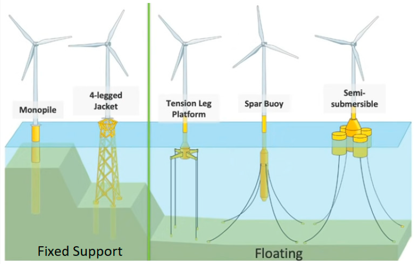

.. SEAHOWL documentation master file, created by
   sphinx-quickstart on Sat Oct 23 18:41:46 2021.
   You can adapt this file completely to your liking, but it should at least
   contain the root `toctree` directive.

SEAHOWL
########

Introduction
============

Numerical simulation of Horizontal Axis Wind Turbines in Floatting environment

Table of Contents
=================

.. toctree::
   :maxdepth: 1
   :caption: Contents

   _user/user

.. toctree::
   :maxdepth: 1
   :caption: Annexes:

   glossary

Indices and tables
------------------

* :ref:`genindex`
* :ref:`modindex`
* :ref:`search`

TODO
------

.. todolist::
