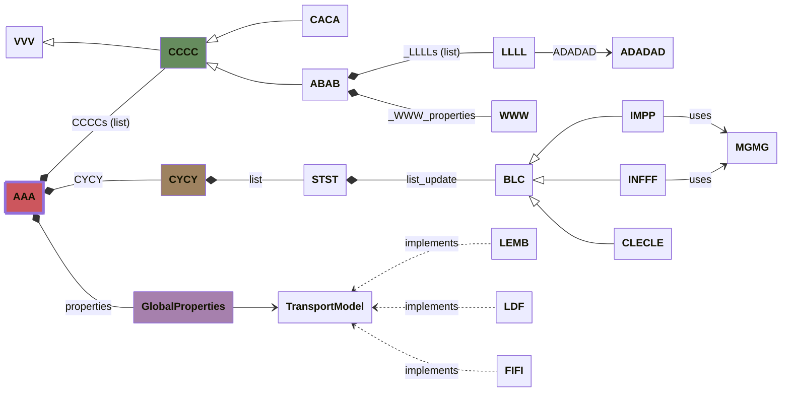

# Developer Documentation

## Classes Overview

This section provides detailed information regarding the User Language classes and their corresponding methods:

* [Main](main-file.md)
* [Turbine](turbine-file.md)
* [Environment](environment-file.md)
* [Blade](blade-file.md)
* [Rna](rna-file.md)
* [Tower](tower-file.md)
* [Floater](floater-file.md)

::: seahowl.core
    options:
      show_root_toc_entry: true

##  Overview



### Legend

```mermaid
classDiagram
    %% Définition des descriptions
    class L1["Inheritance (Subclass)"]
    class L2["Composition (Attr)"]
    class L3["Association (Ref)"]
    class L4["Implementation (ABC)"]

    %% Liens individuels
    A <|-- L1
    B *-- L2
    C --> L3
    D <.. L4

    %% Styles pour cacher les classes sources et aligner les textes
    style A fill:none,stroke:none,color:none
    style B fill:none,stroke:none,color:none
    style C fill:none,stroke:none,color:none
    style D fill:none,stroke:none,color:none

    style L1 fill:none,stroke:none,font-size:12px
    style L2 fill:none,stroke:none,font-size:12px
    style L3 fill:none,stroke:none,font-size:12px
    style L4 fill:none,stroke:none,font-size:12px
```
